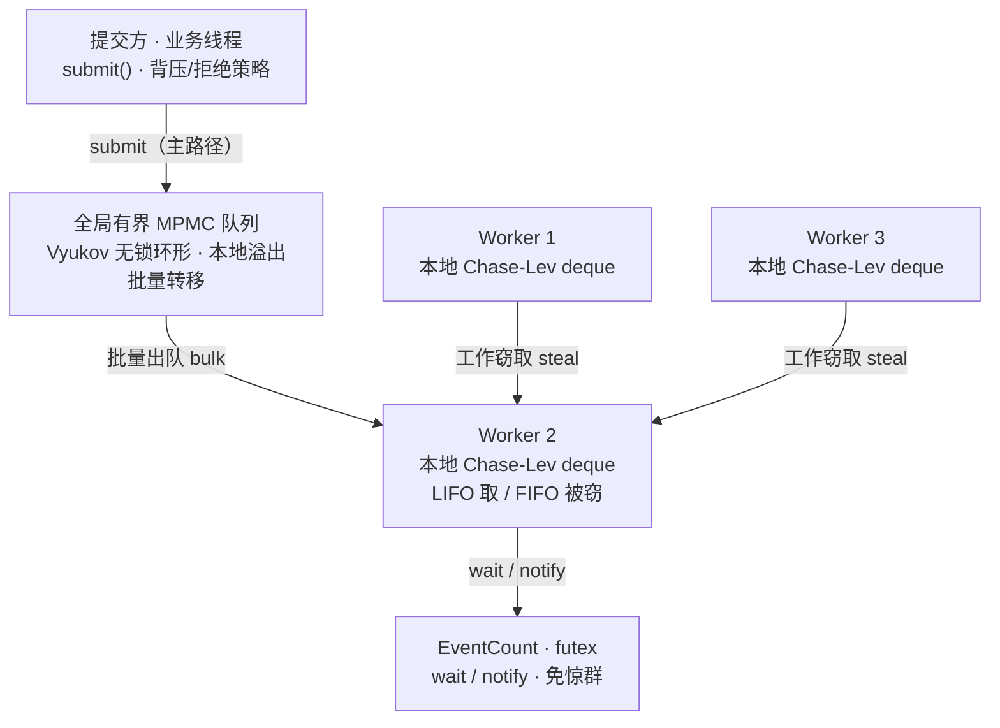
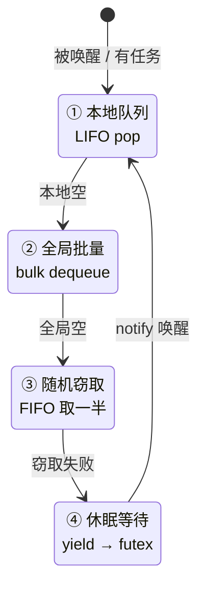

# magpie 设计方案

## 1. 文档目的

本文档定义 `magpie` 的**详细设计方案**：项目定位、业界对标结论、总体架构、公开 API、核心数据结构、运行机制、并发正确性约定与验收指标。

它是以下工作的上位约束：

- `ChaseLevDeque` / `EventCount` / 全局无锁队列等模块设计
- 各类 ADR（Architecture Decision Record）
- benchmark 设计与结果解释
- 后续优化取舍与回归评估

**层次切分约定**：本文档给出每个模块的**实现级骨架**（可编译语义的 C++ 代码）、协议、常量基线与验证矩阵（"实现成什么、顺序是什么"）；严格证明（内存序逐条论证、锁自由性推导、基准原始数据）落在对应的 ADR 与模块文档中（见 [18. 下一步文档](#18-下一步文档)），不得在本文件之外另立互相矛盾的口径。

当某项实现优化与本文档冲突时，应优先回到本文档重新判断，而不是局部"调优到看起来更快"。

命名说明：`Magpie`（喜鹊）取自 work-stealing 的隐喻——空闲的 worker 像喜鹊一样从忙碌的同事那里"窃取"任务。C++ 命名空间统一为 `magpie`，线程池入口类为 `magpie::ThreadPool`。

---

## 2. 项目定位

`magpie` 是一个 **通用高性能 C++ 线程池**，目标是在多核通用环境下替代"每任务一线程"或"单共享队列线程池"的朴素实现，面向以下场景：

- 大量短小 CPU / 混合型任务
- 高线程数、高并发的服务端中间件
- 对吞吐扩展性与尾延迟敏感的系统程序
- 需要背压与可控队列行为的批处理链路

基线架构为：

- 全局有界无锁 MPMC 队列（提交与均衡）
- 每个 worker 的 Chase-Lev 双端队列（本地快路径）
- EventCount / futex 唤醒器（阻塞与唤醒）
- 固定数量 worker 线程组（thread-per-core）

### 2.1 设计原则（决策时的优先级）

1. **先正确、后调优**：所有并发原语初版采用保守的内存序（关键竞争一律 `seq_cst`），由 ADR 逐条论证后放宽，且放宽必须有 TSan 与 benchmark 双重复核。
2. **热路径零共享**：任务执行 cycle 中 worker 只触碰自己的缓存行；跨 worker 交互仅在空转/溢出/窃取时发生。
3. **可解释性优先**：任何性能优化必须能回答 14.2 的五个问题，否则回退。
4. **简单作为兜底**：当一个"聪明"设计与朴素实现的差距无法被 benchmark 证明时，选朴素实现。

---

## 3. 业界对标与借鉴

| 项目 | 调度模型 | 队列 / 同步设计 | 可借鉴点 |
|---|---|---|---|
| JDK ThreadPoolExecutor | 单共享队列 + 弹性线程 | BlockingQueue + ReentrantLock | 拒绝策略、背压 API 设计 |
| JDK ForkJoinPool | 工作窃取 | 每线程双端队列 | LIFO 本地取 / FIFO 被窃取 |
| Intel oneTBB | 任务图 + 窃取 | 每线程可扩容 deque | 嵌套并行、任务依赖 |
| folly::CPUThreadPoolExecutor | 每线程优先队列 | LifoSem(futex) + Vyukov MPMC | 无锁队列、唤醒器、优先级 |
| Rust tokio | 工作窃取 + LIFO slot | 每 worker 本地队列 | 任务预算（防饥饿） |
| brpc bthread | M:N 协程 | 全局队列 + worker 本地缓存 | 阻塞任务不占线程 |
| seastar | thread-per-core | share-nothing | 无共享、极致扩展性 |

### 3.1 共同结论

- **单共享队列是最大的扩展性瓶颈**（争用热点），因此采用每线程本地队列把热路径锁竞争消掉；
- **线程数 = CPU 核数**，靠窃取均衡负载，而不是靠线程切换；
- 空转时不使用 mutex + condvar 硬阻塞，而是 **spin → sched_yield → futex** 三级退避。

### 3.2 由此确定的架构基调

`thread-per-core + 工作窃取 + 无锁/低锁队列 + futex 级唤醒`，必要时再叠加 M:N 协程层。

---

## 4. 总体架构



（示意图：窃取箭头不特指 W2，任意 worker 对均可互窃）

### 4.1 组件职责

- **提交路径**：业务线程优先把任务压入全局有界队列（满则触发拒绝策略，构成天然背压）；若提交者本身就是 worker 线程，可直接入本地 deque，减少一次全局交互。
- **本地 deque（核心）**：每个 worker 独占一个 Chase-Lev 双端队列。自己做 LIFO（后进先出，任务数据还热在缓存里）；窃取者只能从另一端 FIFO 拿。这是 ForkJoinPool / oneTBB 公认的缓存友好语义。
- **全局队列是"均衡器"**：只承担溢出接收和批量再分配，避免成为争用热点。
- **EventCount 唤醒器**：替代 mutex + condvar，底层挂 futex，用世代计数（epoch）防止丢失唤醒，不存在惊群。

### 4.2 数据流全景

1. **外部提交**：`submit() → 全局 MPMC 队列`；队列满 → 拒绝策略（[11](#11-拒绝策略与背压)）。
2. **worker 内部提交**（任务里再提交子任务）：`本地 deque push`，不触碰全局队列。
3. **worker 取任务**：本地 LIFO pop → 全局批量出队 → 随机窃取 → 退避睡眠（[5](#5-运行机制任务获取循环)）。
4. **本地溢出**：本地 deque 满时把一半任务批量倒回全局队列，而不是扩容（[7.1.3](#713-容量策略固定容量-溢出转移)）。
5. **唤醒**：每次入队成功后无条件调用 `notify_one()`（见 7.3.3）；是否真正发 wake 由 EventCount 内部 `waiters_` 闸门判定，一次只放行一个等待者。

---

## 5. 运行机制：任务获取循环

每个 worker 按以下状态机循环取任务：



### 5.1 窃取语义

- 空闲 worker 随机选择受害者，一次窃取**一半任务**（摊薄同步开销）；
- 窃取前先探测全局队列，兼顾公平；
- 本人 LIFO 执行新任务保缓存热，窃取者 FIFO 拿走最老任务。

### 5.2 三级退避

1. 先自旋若干次（等短任务/等锁竞争者释放）；
2. 仍无任务则 `sched_yield` 让出时间片；
3. 最后进入 futex 睡眠，等待 EventCount 通知。

提交侧不抑制通知：每次入队成功后无条件调用 `notify_one()`，由 EventCount 内部闸门决定是否真正唤醒（7.3.3，P0-4 修订后的既定策略）。

### 5.3 worker 主循环（实现级骨架）

```cpp
// src/thread_pool.cpp —— 实现须保持探测顺序与计数纪律，语义不得偏离本骨架
void ThreadPool::worker_loop(WorkerCtx& ctx) {
    if (pin_to_cores_) pin_core(ctx.index);            // 12；失败仅记 warning
    for (;;) {
        // 退出协议：见 9.2 —— stopping → 提交门清零 → pending 清零（检查顺序不可换）
        if (stopping_.load(seq_cst) &&
            in_flight_submitters_.load(seq_cst) == 0 &&
            pending_.load(acquire) == 0)
            break;

        // ⓪ P3-s 修订：spill 溢出逃逸收口（① 之前）。上轮任何 push 触发的认领未转移项在此执行
        // 有界自旋 + CallerRuns——deque 协议已完全收口，用户代码重入触发的新 spill 是完整的新实例，
        // drain 的 swap 交替语义保证其新溢出追加到下一轮（见 drain_spill_overflow 骨架）。
        // 位置纪律：必须在 ① 之前且每轮必达——若漏掉，overflow_ 滞留使"有活干时入睡/退出"成假象；
        // 退出判定与其互保：overflow_ 非空 ⇒ pending > 0（认领项已计数，8.2），故 pending==0 时必为空。
        drain_spill_overflow(ctx);

        // ① 本地 LIFO 快路径
        if (Task* t = ctx.deque.pop()) { run_one(ctx, t); continue; }

        // ② 全局批量出队：领走整批塞入本地（不逐个执行，保 LIFO 热缓存）。
        //    batch[0] 最老：逆序入队，使本地 LIFO 的执行序恢复**该批内** FIFO（P1-3 修订；P3-w 收窄：
        //    跨批/跨 worker/重入提交下的全池执行序不承诺 FIFO，见场景 #16）
        if (size_t n = global_q_.dequeue_bulk(ctx.batch, BULK_LIMIT); n > 0) {
            for (size_t i = n; i-- > 0; ) ctx.deque.push(ctx.batch[i]);
            continue;
        }

        // ③ 随机窃取（7.1）：快路径单 victim 一试，失败不重试（单轮成本有界）；
        //    入睡前（block_on_eventcount）另有全 victim 随机扫描（P1-2 修订）。
        //    随机 victim 由调用方选取（P3-o 修订；抽中自己由函数内自判守卫 return 0）
        if (steal_from_one_victim(ctx, *workers_[ctx.rng_next() % worker_count_]) > 0) continue;

        // ④ 三级退避（参数见常量表）
        if (spin_probe(ctx))  continue;
        if (yield_probe(ctx)) continue;
        block_on_eventcount(ctx);                      // 7.3 协议，醒后回到循环头
    }
    // 无需清空本地队列：退出条件 pending==0 已保证其为空
}

// ---- 退避三件套（实现约定）----
bool ThreadPool::spin_probe(WorkerCtx& ctx) {
    for (int i = 0; i < SPIN_LIMIT; ++i) {
        cpu_relax();                                   // x86 _mm_pause；跨平台封装
        if (Task* t = ctx.deque.pop()) { run_one(ctx, t); return true; }
        if (global_q_.dequeue(ctx.one)) { ctx.deque.push(ctx.one); return true; }
    }
    return false;
}
bool ThreadPool::yield_probe(WorkerCtx& ctx) {
    for (int i = 0; i < YIELD_LIMIT; ++i) {
        std::this_thread::yield();
        if (Task* t = ctx.deque.pop()) { run_one(ctx, t); return true; }
        if (global_q_.dequeue(ctx.one)) { ctx.deque.push(ctx.one); return true; }
    }
    return false;
}
void ThreadPool::block_on_eventcount(WorkerCtx& ctx) {
    // 关停期禁止睡眠：见 9.1 论证——若 drain 期间睡者无新 notify 来源，join 会挂死
    if (stopping_.load(std::memory_order_seq_cst))
        return;
    // 纪律（7.3.2，四步顺序不可改）：
    std::uint64_t key = evc_.prepare_wait();           // ① 拍 epoch 快照
    evc_.enter();                                      // ② 注册等待者（waiters_++，seq_cst）
    if (full_scan(ctx)) {                              // ③ 全量探测：本地/全局 + 全 victim 随机排列各窃一次
        evc_.leave();                                  //    命中则注销返回。③ 必须发生在②之后 ——
        return;                                        //    这是"注册先行"纪律，唤醒闸门的活性论证依赖它
    }
    evc_.wait_registered(key);                         // ④ 写睡眠字 → 复查 epoch → futex 睡（内部注销）
}

// ---- 窃取与全量扫描（P1-C/P1-7/P3-n/P3-o 修订后的落点骨架）----
// victim 由调用方指定（P3-o 修订）：快路径传 rng 随机 victim、full_scan 传随机排列序的逐 victim；
// "全扫各窃一次"的覆盖承诺依赖调用方传入的 victim 序列，函数内仅保留自判守卫（抽中自己放弃本轮）。
size_t ThreadPool::steal_from_one_victim(WorkerCtx& ctx, WorkerCtx& v) {
    if (&v == &ctx) return 0;                                    // 随机 victim 抽中自己：放弃本轮
    // 双向钳制：本方只能吃下"剩余容量的一半"（防窃入即溢出的乒乓，P1-7）；
    // victim 侧由 deque 内部再钳制 (b-t)/2 与 STEAL_CAP（7.1.2）。
    std::size_t cap = std::min<std::size_t>(STEAL_CAP, ctx.deque.free_slots() / 2);
    std::size_t got = v.deque.steal(ctx.batch, cap);             // out[0..got-1] 为 FIFO（最老在前）
    if (got == 0) return 0;
    for (std::size_t i = got; i-- > 0; ) ctx.deque.push(ctx.batch[i]); // 逆序入队：LIFO 执行序恢复该窃取批内 FIFO（P1-C；P3-w 收窄口径同 ②）
    ctx.wstats.stolen.fetch_add(got, std::memory_order_relaxed);      // per-worker 无争用行（13.1）
    return got;
}

bool ThreadPool::full_scan(WorkerCtx& ctx) {
    // 入睡前的最后探测（P1-2）：除自己外全部 worker 随机排列、各窃一次；命中即返回，
    // 由主循环消费。victim 数 = worker_count - 1，无单独上限常量（本身 ≤ 核数，P3-n）。
    if (Task* t = ctx.deque.pop()) { run_one(ctx, t); return true; }
    if (global_q_.dequeue(ctx.one)) { ctx.deque.push(ctx.one); return true; }
    // P3-o 修订：循环变量 v 必须传入窃取函数。旧骨架在函数内重新随机 victim，使
    // shuffled_others 的排列形同虚设、存在漏窃——"有活可干时入睡概率近似为零"（5.3，P1-2）失效。
    for (WorkerCtx* v : shuffled_others(ctx)) {
        if (steal_from_one_victim(ctx, *v) > 0) return true;   // 窃得的任务已逆序入本地
    }
    return false;
}

// ---- pending 统一递减原语（P3-ad / P0 修复，场景 #21）----
// 一切 pending--（完成 / 拒绝回退 / 丢弃退回 / 溢出兜底）必须走本原语。理由：1→0 的归零瞬间
// 必须持锁通知——drain() 的谓词等待只靠该通知重估；拒绝路径若散落 fetch_sub（既往实现），
// "pending==1 只剩这个失败中的提交计数"时归零无通知 ⟹ drain 永久睡眠（完整交错见 10.3 #21）。
void ThreadPool::dec_pending() noexcept {
    if (pending_.fetch_sub(1, std::memory_order_acq_rel) == 1) {
        std::lock_guard<std::mutex> lk(drain_mtx_);    // 持锁通知（P0-6 修订）：与 drain 的谓词等待
        drain_cv_.notify_all();                        // 配对，堵死"检查与等待之间丢失通知"窗口（9.3）
    }
}

// ---- 任务执行单元（异常与计数统一收口，见 8.2/8.3）----
void ThreadPool::run_one(WorkerCtx& ctx, Task* t) {
    try { t->run(); }
    catch (...) {
        std::exception_ptr e = std::current_exception();
        if (t->has_future()) t->deliver_exception(e);  // 兜底通道（packaged_task 已在任务内吸收）
        else if (exception_handler_) {
            // P3-q 修订：回调自身异常必须在 worker 侧吞掉（记日志后继续）——catch 块内再逃逸
            // 将击穿 worker 主循环直达 std::terminate，违背 8.3"任何异常不得逃逸出主循环"的承诺。
            try { exception_handler_(e); } catch (...) { log_handler_exception(); }
        }
    }
    delete t;                                          // 8.1：执行者回收
    ctx.wstats.completed.fetch_add(1, std::memory_order_relaxed);  // per-worker 无争用行（13.1）
    dec_pending();                                     // P3-ad：1→0 通知统一走原语
}

// ---- spill 溢出逃逸口（P3-s 修订 + P3-ad 加固，场景 #18/#20：与 7.1.3 语义一一对应）----
// 唯一执行"认领未转移项"的场所：本函数运行时 deque 已完全一致。drain 采用 swap 交替——
// take_overflow 先换走并清空 deque 侧，内层用户代码重入产生的**新**溢出追加到已清空的
// deque.overflow_，外层继续迭代本地 batch 不受影响，下一轮 while 再处理，天然无迭代器失效。
// 有界自旋的整批共享 deadline（P2-E）在此重新建立：微秒级封顶指"每个 drain 轮次"。
// P3-ad 修订 1（P0-3 修复）：成功重新入队必须**批发布 + 一次 notify**——所有成功入队完成后、
// 执行任何 fallback 用户代码之前调用 evc_.notify_one()（"最后一次入队到 notify 之间只有入队与
// 自旋、无用户代码无阻塞"）；否则睡者既看不到 epoch 推进也等不到唤醒，X 在全局队列长滞。
// P3-ad 修订 2（P0-1/P0-2 联动）：batch 是固定容量数组而非 vector——deque 侧溢出缓冲已改为
// 固定容量 + 显式计数（§7.1.1），take_overflow 交出数组与计数，全程 noexcept。
void ThreadPool::drain_spill_overflow(WorkerCtx& ctx) {
    while (ctx.deque.has_overflow()) {
        std::array<Task*, BATCH_CAP> batch;
        std::size_t n = 0;
        ctx.deque.take_overflow(batch, n);              // swap 交替：返回旧缓冲与计数
        const std::uint64_t deadline = tsc_now() + LOCAL_SPIN_US_TICKS;
        std::size_t reenq = 0, fail = n;
        for (std::size_t i = 0; i < fail; ++i) {        // 第一遍：只入队，不执行用户代码
            Task* x = batch[i];
            bool done = global_q_.enqueue(x);
            while (!done && cpu_relax_limited(deadline)) done = global_q_.enqueue(x); // 11.2 有界自旋
            if (done) ++reenq;
            else      std::swap(batch[i], batch[--fail]);   // 失败项压至尾部，本轮不执行
        }
        if (reenq > 0) evc_.notify_one();               // P3-ad（P0-3 修复）：批发布 + 一次 notify
        for (std::size_t i = fail; i < n; ++i) {        // 第二遍：fallback 项就地执行（用户代码）
            counters_.rejected.fetch_add(1, std::memory_order_relaxed);  // P2-D 记账上移（13.2）
            run_one(ctx, batch[i]);                     // CallerRuns 兜底；pending 由 run_one 经 dec_pending 配平（8.2）
        }   // fallback 内用户代码重入提交自带 notify（8.4 快路径），无需本函数补
    }
    // 终止性：每轮至少消费一个任务（run_one 或入全局）；任务集合有限，用户代码无限自提交
    // 与 CallerRuns 嵌套同属既定取舍（9.5），不由本函数兜底。
}
```

约束与说明：

- **探测顺序固定**：本地 → 全局 → 窃取。理由：本地是热缓存、全局是公平性兜底、窃取是最后手段。任何实现改动该顺序必须在 ADR 中给出 benchmark 依据。
- **两级窃取**：主循环快路径每轮只试 1 个随机 victim（单轮成本有界）；spin/yield 退避期间不窃取；**入睡前**执行一次全 victim 随机排列扫描（P1-2 修订）——保证"有活可干时入睡"的概率近似为零，而不是等待 O(N) 轮循环才碰对 victim。
- **溢出逃逸纪律（P3-s）**：所有 `push` 调用点（提交快路径 / bulk / 窃取接收 / 探测兜底）都不就地执行用户代码；spill 产物只能经 ⓪ 步的 `drain_spill_overflow` 或提交快路径的收口调用落地。任何新增 push 调用点必须复查 overflow 是否会在其上下文中滞留（滞留 = pending 永不为零 = drain/join 挂死）。
- 退避参数与各限额集中收敛于常量表（见 16.2），初版取基线值、阶段二标定，对外不承诺可调。

---

## 6. 公开 API 设计

### 6.1 命名空间与基础类型

```cpp
namespace magpie {

// 任务的可执行契约：虚调用统一执行路径，避免耦合 std::function
class Task {
public:
    virtual ~Task() = default;
    virtual void run() = 0;      // 允许抛出（异常路由见 8.3），但 run_one 永远兜底 try/catch
    virtual bool has_future() const noexcept { return false; }   // submit_async 的 TaskImpl 覆写为 true（8.3）
    virtual void deliver_exception(std::exception_ptr) noexcept {} // 基类空实现；future 通道覆写（8.3）
};

// 全局队列满时的拒绝策略
enum class RejectionPolicy {
    CallerRuns,      // 提交者在当前线程直接执行任务（推荐默认，天然背压）
    Abort,           // 抛出 QueueFullError
    DiscardOldest,   // 从全局队列头丢弃最旧任务后接收新任务
};

// P3-ae（G3 修复：错误可区分性）——满与关停的恢复动作相反，调用方必须能分支：
enum class QueueFullReason { QueueFull, ShuttingDown };

class QueueFullError : public std::runtime_error {
public:
    explicit QueueFullError(QueueFullReason r) : std::runtime_error(reason_text(r)), reason(r) {}
    QueueFullReason reason;
private:
    static const char* reason_text(QueueFullReason);   // "queue full" / "pool is shutting down"
};
```

### 6.2 ThreadPool 类

```cpp
struct ThreadPoolOptions {
    std::size_t worker_count = 0;             // 0 → std::thread::hardware_concurrency()
    std::size_t global_queue_capacity = 4096; // 有界；向上取整为 2 的幂；池层下限 ≥16（断言）；MPMCQueue 自身最小容量 2，见 7.2.1
    std::size_t local_deque_capacity = 1024;  // 每 worker 固定容量（2 的幂，见 7.1.3）
    RejectionPolicy rejection = RejectionPolicy::CallerRuns;
    bool pin_to_cores = false;                // 构造时顺次绑核（见 12）
    std::size_t worker_stack_size = 0;        // P3-q 修订：worker 线程栈大小（字节）；0 = 系统默认。深嵌套 fork/join +
                                              // CallerRuns 叠加可能击穿 8MB 默认栈（见 9.5）；非零值仅在 pthread 后端
                                              // 生效（pthread_attr_setstacksize，见 12），generic 后端记录 warning 忽略。
    std::function<void(std::exception_ptr)> exception_handler;  // 裸 submit 任务的异常回调，默认 stderr，见 8.3
};

class ThreadPool {
public:
    explicit ThreadPool(const ThreadPoolOptions& opts = {});
    ~ThreadPool();                            // 等价于 shutdown() + drain()，见 9.4

    ThreadPool(const ThreadPool&) = delete;
    ThreadPool& operator=(const ThreadPool&) = delete;
    ThreadPool(ThreadPool&&) = delete;
    ThreadPool& operator=(ThreadPool&&) = delete;

    // fire-and-forget 提交：任务入全局队列；满则按 rejection 策略
    // P3-ac（薄模板拆法）：本模板在头文件内定义，只做"构造 TaskImpl<decay_t<F>> + 移交非模板
    // submit_task(Task*)"两步，池化逻辑全在 .cpp；拆法理由与顺序差异见 16.1 P3-ac。
    template <class F>
        requires std::invocable<std::decay_t<F>>   // C++20 概念约束（P3-p 修订：对 decay 后类型判定，见 6.3）
    void submit(F&& f) {
        submit_task(new TaskImpl<std::decay_t<F>>(std::forward<F>(f)));
    }

    // 可等待提交：返回 std::future；异常经 future 传递（见 8.3）。
    // P3-u 警告：worker 任务内**阻塞等待**池内 future（如 .get()/wait()）是禁止项（结构性死锁，
    // 见 6.4 / 9.5）——std::future 的等待无法被运行时拦截，本约束是文档契约而非可断言行为。
    // P3-ac：future 抽取（packaged_task::get_future）在本模板内完成，仅 Task* 进入池主体。
    template <class F>
        requires std::invocable<std::decay_t<F>>
    auto submit_async(F&& f) -> std::future<std::invoke_result_t<std::decay_t<F>>> {
        using R = std::invoke_result_t<std::decay_t<F>>;
        std::packaged_task<R()> pt(std::forward<F>(f));
        std::future<R> fut = pt.get_future();
        submit_task(new TaskImpl<std::packaged_task<R()>>(std::move(pt)));
        return fut;
    }

    void shutdown();                          // 幂等；停止接收；唤醒全部 worker（见 9.1）
    void drain();                             // 阻塞等待全局静止点（quiescence，P3-v 见 9.3）；持续提交下可能永不返回

    std::size_t worker_count() const noexcept;

    struct Stats {                            // 内置指标，见 13
        std::uint64_t submitted = 0;          // 成功入池的任务总数
        std::uint64_t rejected  = 0;          // 拒绝策略触发次数（CallerRuns 的背压触发也计入）
        std::uint64_t discarded = 0;          // DiscardOldest 丢弃的任务数
        std::uint64_t stolen    = 0;          // 窃取成功的任务数
        std::uint64_t completed = 0;          // 执行完成的任务数
        std::uint64_t pending   = 0;          // 实时在途数（真实进出差，见 8.2/13）
        std::uint64_t wakes     = 0;          // futex_wake/notify 调用次数（futex/generic 两版都记）
        std::uint64_t wake_threads = 0;      // P3-ad：FUTEX_WAKE 返回值的累计和（实际被唤醒线程数；
                                             //   generic 版无返回值语义，记 notify_all 为 1 并注明近似）
        std::uint64_t post_wake_hit = 0;     // P3-ad：被唤醒后第一轮探测命中任务次数（13，替换 wakes_effective 旧口径）
        std::uint64_t post_wake_empty = 0;   // P3-ad：被唤醒后第一轮探测落空次数
        std::uint64_t pre_sleep_scan_hit = 0;   // P3-ad：入睡前 full_scan 命中次数（旧 wakes_effective 语义迁此，不属"唤醒"）
        std::uint64_t pre_sleep_scan_empty = 0; // P3-ad：入睡前 full_scan 落空次数（旧 wake_empty_scans 迁此）
        std::uint64_t local_spills = 0;       // 本地 deque 溢出到全局队列的次数
    };
    Stats stats() const;                      // 读一份原子快照

private:
    void submit_task(Task* t);                // P3-ac：非模板提交入口（.cpp 定义，承接 8.4 的 S0–S4 全部池化逻辑）
};

} // namespace magpie
```

### 6.3 任务表示与包装

- `submit(F&&)` 将调用对象包装进 `TaskImpl<std::decay_t<F>>`（`final` 派生类，所有权成员 `std::decay_t<F> f_`，`run()` 内 `f_()`；P3-p 修订：`F` 的引用性在越过 TaskImpl 边界前衰减，否则左值实参会推导出引用成员），**一次堆分配**，获得 `Task*` 后所有权移交线程池（P3-ac：该分配发生在公开头薄模板内，随后移交非模板 `submit_task(Task*)`，拆法见 16.1；见 [8](#8-任务生命周期与所有权)）。模板约束为 C++20 概念的 `std::invocable<std::decay_t<F>>`（§6.2），decay 后类型天然满足可移动要求。
- **不采用 `std::function`** 作为队列元素：`Task*` 是无锁队列的天然载荷，vcall 开销确定，且后续可无缝接入自定义分配器/批量 arena；`std::function` 的 SBO 行为、异常规格与尺寸不可控。
- 任务在队列间移动**只传指针**，任何转移路径不拷贝、不移动任务本体。

### 6.4 提交语义

- `submit` / `submit_async` 线程安全，可从任意线程调用；提交本身仅做包装分配 + 一次 MPMC 入队，**无锁、不 wait**（P3-x 边界注：lock-free 为 try 语义——入队可因满返回、出队可因头部 reservation hole 判空，非"无卡点"；见 7.2.2 说明与 mpmc-queue-adr §3.2）。
- **worker 线程内提交走快路径**：通过 `static thread_local WorkerCtx*` 标记（worker 线程入口设置）识别提交者身份，直接 push 本地 deque（先入本地，装满按 7.1.3 溢出）。此快路径对用户透明，不提供单独 API。**P3-u 修订**：push 后**无条件调用 `notify_one()`**（"本人正在执行任务故无需 notify"的原论证只覆盖非阻塞嵌套；废除后快路径与外部提交统一遵守 D2'，见 7.3.3/ADR-002 v2.4），随后 `drain_spill_overflow` 收口（notify 先于 drain 的顺序纪律见 8.4 骨架注释）。
- **worker 内阻塞等待池内 future 是禁止项（P3-u，P0 级缺陷收口）**：任务代码内对提交进本池的 `std::future` 做任何阻塞等待（`.get()`/`wait()`/定时变体）构成结构性死锁——child 在其父 worker 的本地 deque 中，父线程阻塞后不会再 pop，若其他 worker 已入睡且无外部提交（或池仅 1 个 worker），child 永不被执行，pending 恒 > 0，`drain`/析构随之挂死。本禁令属**文档契约**：`std::future::get` 无法被池运行时拦截（无可断言点），违反的故障签名为"pending 停滞 + drain/join 挂死"。放行路径是 **W2.11 立项的 helping wait 语义草案（P3-ae，G2）**——等待期间代为取任务执行（ForkJoin/TBB 语义），随自定义池内 future 或 `wait_helping` API 落地（见 16.4）。
- `submit_async` 与拒绝策略的交互：策略为 `Abort` 时抛 `QueueFullError(QueueFull)`；为 `DiscardOldest` 时丢弃全局队列最旧任务后入队；为 `CallerRuns` 时**就地执行并在返回的 future 中就绪结果**（不进入队列；pending 按 8.2 净零计入，受提交门覆盖）。**P3-ae（G3）**：`QueueFullReason` 区分两种不可混同的失败——`QueueFull`（可重试/背压）与 `ShuttingDown`（S0 拒绝，不可重试），调用方应按 `reason` 分支恢复。
- 析构函数语义见 [9.4](#94-析构行为)。

### 6.5 初版不提供的 API（显式列出，避免误用）

- 无优先级提交接口（非目标，[15](#15-非目标初版)）；
- 无 `submit_with_timeout`；背压由队列容量 + 拒绝策略承担，锁死场景交给 `CallerRuns` 消化；
- 无单任务的 `std::launch` 式执行策略参数。

---

## 7. 关键数据结构

### 7.1 ChaseLevDeque：本地任务双端队列

#### 7.1.1 类定义与布局

```cpp
// include/magpie/chase_lev_deque.h —— header-only（热路径内联）
// 每 worker 一个；固定容量环形（2 的幂）；初版不做动态扩容
class ChaseLevDeque {
public:
    explicit ChaseLevDeque(std::size_t capacity,
                           MPMCQueue<Task*>& gq,
                           EventCount& evc,
                           WorkerStats& wstats);   // 向上取整为 2 的幂，且 ≥ 16；三引用均为池注入：
                                                   // 溢出目标 / 溢出后唤醒（P2-G）/ per-worker 统计（P2-D）

    // —— 本地接口（仅 owner worker 调用，不加锁）——
    void push(Task* t);                                  // 写满自动溢出（7.1.3）
    Task* pop();                                         // LIFO；空返回 nullptr
    bool spill_lowest_half();                            // 把最老一半倒入全局队列；true=完成转移，false=CAS 失竞争或无可溢出
    // P3-s 修订：溢出逃逸通道——spill 认领后入全局失败的项暂存于 deque 内 overflow（deque 内禁止
    // 执行用户代码），由 owner 取走移交池层 drain_spill_overflow（5.3）执行有界自旋 + CallerRuns。
    bool has_overflow() const noexcept;                  // = (overflow_count_ != 0)
    // P3-ad 修订（P0-1/P0-2 修复）：take_overflow 交出**固定容量数组 + 显式计数**（不再是 vector），
    // swap 交替语义保留（换走当前 in 缓冲、换入 spare，内层重入的新溢出追加到 spare）；全程 noexcept。
    void take_overflow(std::array<Task*, BATCH_CAP>& out, std::size_t& n) noexcept;

    // —— 窃取接口（任意 worker 调用）——
    std::size_t steal(Task** out, std::size_t max_n);    // FIFO；返回实际窃取数，可为 0
    std::size_t free_slots() const noexcept;             // = capacity - (bottom - top)，供窃取量钳制（P1-7）

private:
    MPMCQueue<Task*>& gq_;                               // 池注入：溢出转移的目标全局队列
    EventCount& evc_;                                    // 池注入：溢出转移完成后的唤醒（7.3.3/P2-G）
    WorkerStats& wstats_;                                // 池注入：local_spills 记账（per-worker 行，13.1）
    std::size_t mask_;                                   // = capacity - 1
    // P3-ad 修订（P0-1/P0-2 修复，容量上界证明见 ADR-001 §4.6）：溢出暂存必须是**固定容量、
    // noexcept** 的双缓冲，取代 vector：
    //   P0-2：spill 在 top CAS 认领**之后**暂存——vector 扩容若在此抛 bad_alloc，已认领任务卡死在
    //         中途（线性化点之后的可抛操作），任务守恒被破坏；固定数组 + 显式计数全程 noexcept。
    //   P0-1：**禁止任何路径 clear 已有暂存**（旧实现每次 spill 先 clear：容量取下限 16 时，bulk 的
    //         BULK_LIMIT=32 连续 push 可在一个 drain 前触发两次 spill，第一批暂存被永久丢失）。
    //         本修订后 spill 只 append、不做其他任何清理。
    //   容量上界（ADR-001 §4.6 证明）：两次 drain 之间 append 总量 ≤ 期间 push 数 ≤ BATCH_CAP
    //         （快路径每次 push 后即 drain（8.4）；② 批量 ≤ BULK_LIMIT；③ 窃取批 ≤ STEAL_CAP）；
    //         spill 每次认领 ≤ capacity/2（I1）。static_assert(溢出缓冲 == BATCH_CAP)。
    //   swap 交替语义（5.3）保留：two-array + 轮换指针，take 时换缓冲、内层重入追加到 spare。
    alignas(CACHE_LINE) std::array<Task*, BATCH_CAP> overflow_a_;
    alignas(CACHE_LINE) std::array<Task*, BATCH_CAP> overflow_b_;
    std::array<Task*, BATCH_CAP>* overflow_in_   = &overflow_a_;   // spill 只 append 到此
    std::size_t                   overflow_count_ = 0;
    // 缓存行 A：窃取端。多个窃取者在此 CAS 竞争
    alignas(CACHE_LINE) std::atomic<std::int64_t> top_{0};
    // 缓存行 B：本地独占写；窃取者只以 acquire 读
    alignas(CACHE_LINE) std::atomic<std::int64_t> bottom_{0};
    // 槽位数组：每槽独占一条缓存行（消伪共享）；构造函数必须逐槽
    //  buf_[i].p.store(nullptr, relaxed) 初始化。P3-p 修订（C++20 口径）：C++20 起
    //  原子默认构造为 value-init（Task* → nullptr），P2-10 原注"C++17 默认构造不置值"
    //  已不再成立——显式逐槽初始化保留，但定位降级为纪律性冗余，不是正确性必需。
    //  P3-q 修订（布局对照实验，W2.9）：1024 槽 × 64B = 64KB/worker 超出 L1d 常驻能力，
    //  有悖"任务数据热缓存"——但窃取/批量出队是顺序批量读相邻槽，紧凑布局下跨线程同行的
    //  窗口主要存在于 top/bottom 两端。故"每槽一行"只作为初版形态，紧凑布局（每槽 8B）为
    //  W2.9 的并列对照变体，由 bench_fine_grain/bench_empty_task 缓存 miss 数据裁决最终布局，
    //  禁用"防伪共享"先验判断；全局队列 4096 槽 × 64B = 256KB 同批裁决，见 7.2.1。
    struct alignas(CACHE_LINE) SlotPtr { std::atomic<Task*> p; };
    std::unique_ptr<SlotPtr[]> buf_;                     // capacity 个槽
};
```

`CACHE_LINE` 定义：取 `std::hardware_destructive_interference_size`（P3-p 修订，见 16.2 常量基线）；ARM 大页系统若编译器仍报 64，按 16.2 的探测/宏覆盖纪律处置（写入 ADR 常数表）。

#### 7.1.2 算法实现骨架

```cpp
void ChaseLevDeque::push(Task* t) {
    std::int64_t b = bottom_.load(std::memory_order_relaxed);
    if (b - top_.load(std::memory_order_seq_cst) >= (std::int64_t)(mask_ + 1)) {
        spill_lowest_half();                   // 先清场（溢出后重读，真实不变量见下方"关键性质"，P1-1）
        b = bottom_.load(std::memory_order_relaxed);
    }
    buf_[b & mask_].p.store(t, std::memory_order_relaxed); // ① 先写槽位
    bottom_.store(b + 1, std::memory_order_release);    // ② 再发布：任务对窃取者可见
}

Task* ChaseLevDeque::pop() {                   // 仅本地线程调用
    std::int64_t b = bottom_.load(std::memory_order_relaxed);
    b -= 1;                                        // bottom==0 时 b=-1，由下方回正分支兜底（空队判据）
    bottom_.store(b, std::memory_order_relaxed);
    // P0-B 修订：bottom 的 relaxed 写与 top 的读之间必须有 StoreLoad 序——否则存在交错"窃取者
    // 已按旧 bottom 完成 CAS 认领、本线程的 top 读仍拿到旧值"，常规分支的槽位 b 会与窃取区间
    // 重叠（x86 上 relaxed store → seq_cst load 无屏障；fence 承担全部次序后 top 读可降为 relaxed）。
    std::atomic_thread_fence(std::memory_order_seq_cst);
    std::int64_t t = top_.load(std::memory_order_relaxed);
    if (b >= t) {                                          // 常规路径：与窃取者无交集
        Task* x = buf_[b & mask_].p.load(std::memory_order_relaxed);
        if (b == t) {                                      // 最后一个任务：与窃取者竞争
            if (!top_.compare_exchange_strong(t, t + 1,
                    std::memory_order_seq_cst, std::memory_order_seq_cst))
                x = nullptr;                               // 输给窃取者
            bottom_.store(t + 1, std::memory_order_relaxed); // 无论胜负都归位
        }
        return x;
    }
    // b < t：任务已被窃取者批量拿空，回正指针
    bottom_.store(t, std::memory_order_relaxed);
    return nullptr;
}

std::size_t ChaseLevDeque::steal(Task** out, std::size_t max_n) {
    if (max_n == 0) return 0;   // P3-ab 契约修复：调用方显式要求零窃取 ⟹ 零副作用返回（不读槽、不 CAS、不动 top/bottom）
    std::int64_t t = top_.load(std::memory_order_seq_cst);
    std::int64_t b = bottom_.load(std::memory_order_acquire); // 配对 push 的 release
    if (b <= t) return 0;                              // 空（或正被本地回正）
    std::size_t n = std::min<std::size_t>({ (std::size_t)max_n, (std::size_t)STEAL_CAP, (std::size_t)((b - t) / 2) }); // 内部钳制（STEAL_CAP 由 deque 强制，防御式）
    // 此处的 n==0 仅剩一种来源：b−t==1（区间只剩一个任务）——"不足 1 抬到 1"只服务该情形；
    // max_n==0 已在入口早退，两者不再混同（P3-ab）。
    if (n == 0) n = 1;
    // P3-r 修订（P0 修复，场景 #17：环形槽复用竞态）：候选先锁存、CAS 后置。原"CAS 先抢、再读槽"
    // 存在存储生命周期洞——CAS 一成功，[t,t+n) 即退出 [top,bottom)，owner 的 push 守卫（b-top≥capacity）
    // 读到推进后的 top 而放宽，可合法覆盖这些物理槽（容量绕圈），窃取者随后读到的是新任务：
    // 原任务永久丢失 + 新任务被双重消费。锁存在先的时间窗内 top 仍为 t，push 守卫在 bottom 触及
    // t+capacity 前必然阻断（推导见 ADR-001 §4.4），故锁存值恒绑定原逻辑槽；CAS 失败则整批丢弃
    //（读到的脏值作废——此刻 top 已被他人推进、原槽内容已被合法消费，丢弃即正确）。
    for (std::size_t i = 0; i < n; ++i)
        out[i] = buf_[(t + (std::int64_t)i) & mask_].p.load(std::memory_order_relaxed);
    if (!top_.compare_exchange_strong(t, t + (std::int64_t)n,
            std::memory_order_seq_cst, std::memory_order_seq_cst))
        return 0;                                      // 与其他窃取者竞争失败：丢弃已锁存候选
    return n;
}

bool ChaseLevDeque::spill_lowest_half() {
    // = 自偷一半：把最老 [top, mid) 倒入全局，保留最新半段留在本地（新任务数据更热）
    std::int64_t t = top_.load(std::memory_order_seq_cst);
    std::int64_t b = bottom_.load(std::memory_order_relaxed);
    std::int64_t mid = t + (b - t) / 2;
    if (mid == t) return false;                        // 无可溢出
    if (!top_.compare_exchange_strong(t, mid,
            std::memory_order_seq_cst, std::memory_order_seq_cst))
        return false;                                  // 与窃取者并发：让出本轮（P1-1）
    wstats_.local_spills.fetch_add(1, std::memory_order_relaxed);  // P2-D：注入的 per-worker 行，统计溢出次数
    // P3-s 修订（P0 修复，场景 #18：spill 内执行用户代码导致 deque 重入）：deque 协议完全收口前
    // 禁止执行任何用户代码——旧版在入队失败时 run_one_local，用户任务再 submit 会重入本 deque 的
    // push/spill，内层 push 以"提交次数"推进 bottom、外层以"已锁存次数"推进游标，速度差使物理别名
    // 落到未锁存认领槽 ⟹ 原任务丢失 + 重入任务双消费（同类于场景 #17，证明见 ADR-001 §4.5）。
    // 现版：每项仅单次尝试入队，失败即暂存 overflow（无自旋、无等待、无用户代码）；有界自旋与
    // CallerRuns 兜底整体移交池层 drain_spill_overflow（5.3）——彼时 deque 状态已一致。
    // P3-ad（P0-1 修复）：**禁止 clear**——本函数只 append 到 overflow，绝不清理既有暂存
    // （旧版的 overflow_.clear() 在容量下限 16 + BULK_LIMIT 32 的连续 bulk push 下会丢任务）。
    std::size_t transferred = 0;
    for (std::int64_t i = t; i < mid; ++i) {
        Task* x = buf_[i & mask_].p.load(std::memory_order_relaxed);
        if (gq_.enqueue(x)) ++transferred;
        else {                                          // 固定容量 + 显式计数（P3-ad，P0-2 修复）：
            MAGPIE_ASSERT(overflow_count_ < BATCH_CAP); // 容量上界由 ADR-001 §4.6 证明；写满即证明失效
            (*overflow_in_)[overflow_count_++] = x;     // 只 append，绝不就地执行（P1-6 纪律同步改写）
        }
    }
    if (transferred > 0) evc_.notify_one();            // P2-G：溢出入队同样承担唤醒义务（7.3.3 的"一切入队点"）
    return true;
}
```

关键性质（证明细节归 ADR）：

- **push/pop 无锁**：本地路径只有 `bottom_` 的单调写，不与窃取者竞争；`top_` 只有读取与边缘 CAS。
- **线性化点**：push 在 `bottom` 的 release store；pop/steal 在各自对 `top` 的成功 CAS；spill 与窃取者共享 `top` 的 CAS，故二者并发时**恰有一方成功**，天然无活锁。
- **批量窃取的边界情形**：`steal` **候选先锁存槽值、再 CAS 抢占 `[t, t+n)` 所有权**（P3-r——"CAS 先、读后"的环形槽复用竞态见 §10.3 场景 #17，安全性推导见 ADR-001 §4.4）；本地 `pop` 在 `b == t` 的竞争分支保证不会读到已被抢占的槽位。`b < t` 分支处理"窃取者批量取走、本地 bottom 落在被偷区间内"的中间态——这是批量窃取区别于经典单任务窃取的唯一新增复杂度（输入走差分测试 BulkStealInterleave 特压）。
- **内存序**：初版 `top` 的 CAS 全部 `seq_cst`；pop 的 `top` 读为 `relaxed` + 前置 `seq_cst` fence（P0-B，StoreLoad 序由 fence 承担）；`bottom` 本地写 `relaxed`（push 尾部 `release`）、窃取者读 `acquire`。阶段二收敛后由 `chase-lev-deque-adr.md` 逐条给出放宽论证与 TSan 数据，然后才允许降级。
- **push 的溢出后重读**：`spill` 返回 false 当且仅当并发窃取者已通过 CAS 推进 top——每次推进 ≥1（steal 的 n 被钳制 ≥1）——故重读后必有 `b − top ≤ capacity − 1`，写槽安全（P1-1）。注意此论证依赖 n ≥ 1 钳制，任何把窃取粒度改为可为零的优化必须先改写本不变量。不变量 `0 ≤ b − t ≤ capacity` 仍由"push 写入前检查溢出、pop/steal 只减不增"共同维持（其中 `b-t == capacity` 只在 push 刚完成的瞬间出现）。

#### 7.1.3 容量策略：固定容量 + 溢出转移

初版**不做动态扩容**（取代原骨架注释中"扩容带版本号防 ABA"的方案）。理由：

1. 全局队列的定位就是"溢出接收者"，本地满即倾倒一半到全局，闭环天然存在；动态扩容等于再造一个无锁可扩数组，ABA 防护（top 标记位/版本号）是本项目最复杂的并发正确性风险；
2. fork/join 型负载中本地 deque 深度通常很浅，固定 1024 槽足够；
3. 收益面窄：本地 deque 深度大意味着负载偏斜，本应由窃取机制消化，而不是让单 worker 越攒越多。

`spill_lowest_half()` 语义（实现见 7.1.2）：复用窃取协议"自偷一半"——owner 对本 deque 的 `top` 做一次 CAS 抢占 `[top, mid)`，把最老半段按 FIFO 顺序**单次尝试**批量入全局队列，最新半段留在本地（数据更热）。全程只发生在本地 deque 与全局队列之间，不经过其他 worker 的队列；与并发窃取者共享 `top` CAS，恰一方成功、无活锁。**P3-s 修订（场景 #18）**：入全局失败项不重试、不就地执行，暂存 `overflow_` 移交池层 `drain_spill_overflow`（5.3）——池层对整批执行有界自旋（11.2"局部自旋"约定，P2-E 共享 deadline 语义上移至此），仍失败则按 CallerRuns 就地执行（此时 deque 状态已一致，用户代码可安全重入）。deque 内部绝无用户代码执行；`local_spills` 在 spill 入口记账、`rejected` 在池层逃逸口记账（13.2）。

演进空间：若 benchmark 证明深 deque 场景开销不可接受，则回到"扩容 + 版本号"方案，作为独立 ADR 立项，不阻塞初版。

### 7.2 全局 MPMC 队列（Vyukov 有界环形）

#### 7.2.1 类定义与布局

```cpp
// include/magpie/mpmc_queue.h —— header-only；有界，容量 2^n
template <class T>
class MPMCQueue {
public:
    explicit MPMCQueue(std::size_t capacity)               // 向上取整为 2 的幂，≥ 2；池层层级下限 16（§6.2）；4096 槽内存 256KB
        : mask_(capacity - 1), slots_(capacity) {
        for (std::size_t i = 0; i < capacity; ++i)
            slots_[i].seq.store(i, std::memory_order_relaxed);
            // 关键初始化：槽 i 的令牌 = i ⇒ 首轮 enqueue 在第 i 个位置遇到 seq==pos 即可用
    }

    bool enqueue(T* item);                                 // 满返回 false
    bool dequeue(T*& item);                                // 空返回 false
    std::size_t dequeue_bulk(T** out, std::size_t limit);  // 连续单元素出队，最多 limit 个
    bool discard_oldest(T*& dropped);                      // = 出队队列头（供 DiscardOldest）

private:
    struct alignas(CACHE_LINE) Slot {
        // 生命周期令牌：seq == pos ⇒ 空槽可写；seq == pos+1 ⇒ 已发布可读；
        // seq == pos+capacity ⇒ 已消费（dequeue 释放时写入）
        std::atomic<std::size_t> seq;
        T* data;
    };
    const std::size_t mask_;
    std::vector<Slot> slots_;
    // 头/尾索引分属不同缓存行，消除伪共享
    alignas(CACHE_LINE) std::atomic<std::size_t> enqueue_pos_{0};
    alignas(CACHE_LINE) std::atomic<std::size_t> dequeue_pos_{0};
};
```

#### 7.2.2 入队 / 出队实现骨架

```cpp
// 协议纪律（正确性关键）：先检查槽位状态、后 CAS 抢占位置；放弃（返回 false）绝不携带抢占。
// 反例：若先 fetch_add 抢占再判满，被抢占线程可以让"位置被消费为空的洞"与"迟到写入"交错，
// 造成已入队任务永远不被消费 + 槽位世代永久错位（证明见 mpmc-queue-adr.md §3）。
template <class T>
bool MPMCQueue<T>::enqueue(T* item) {
    std::size_t pos = enqueue_pos_.load(std::memory_order_relaxed);
    for (;;) {
        Slot* slot = &slots_[pos & mask_];
        std::size_t seq = slot->seq.load(std::memory_order_acquire);
        std::intptr_t diff = (std::intptr_t)seq - (std::intptr_t)pos;
        if (diff == 0) {                                    // 槽位确认空闲
            if (enqueue_pos_.compare_exchange_weak(pos, pos + 1, relaxed))
                break;                                      // 抢占成功才落笔
            // CAS 失败：pos 已被失败路径更新为最新值，重读新槽
        } else if (diff < 0) {
            return false;                                   // 满（槽世代落后一整圈，见 ADR §3.2）
        } else {
            cpu_relax();                                       // 缓解绕圈罕见路径的争用（P2-12）
            pos = enqueue_pos_.load(std::memory_order_relaxed); // 落后于队头：追上新位置
        }
    }
    slot->data = item;
    slot->seq.store(pos + 1, std::memory_order_release);    // 发布
    return true;
}

template <class T>
bool MPMCQueue<T>::dequeue(T*& item) {
    std::size_t pos = dequeue_pos_.load(std::memory_order_relaxed);
    for (;;) {
        Slot* slot = &slots_[pos & mask_];
        std::size_t seq = slot->seq.load(std::memory_order_acquire);
        std::intptr_t diff = (std::intptr_t)seq - (std::intptr_t)(pos + 1);
        if (diff == 0) {                                    // 槽位确认已发布
            if (dequeue_pos_.compare_exchange_weak(pos, pos + 1, relaxed))
                break;                                      // 抢占成功才读取
        } else if (diff < 0) {
            return false;                                   // 空
        } else {
            cpu_relax();                                       // P3-d：与 enqueue 对称，缓解绕圈罕见路径的争用
            pos = dequeue_pos_.load(std::memory_order_relaxed);
        }
    }
    item = slot->data;
    slot->seq.store(pos + mask_ + 1, std::memory_order_release); // 释放槽位（= pos + capacity）
    return true;
}
```

说明：

- `compare_exchange_weak` 失败时 `pos` 已被更新为当前头/尾值，循环自然落到新槽位；spurious 失败则原地重试，无害。
- `diff > 0` 分支的真正来源是函数入口 `enqueue_pos_.load()` 与 `slot->seq.load()` 之间队列可能已绕满一圈（槽世代领先 pos 整圈），并非 CAS 的 spurious 失败（`compare_exchange_weak` 失败时 pos 参数已被更新为最新值）。重读自愈在实践中瞬态收敛、形式上无上界；`cpu_relax` 用于降低该罕见路径的争用（P2-12）。
- **Reservation hole 边界（P3-x）**："判空 ⟺ 头部槽未发布"只是头部判定——producer 抢占位置后被调度挂起时，`try_dequeue()==false` 可与"p+1 等后继位置已发布"并存（consumer 无法越过头部洞）；洞窗时长受调度器支配、形式上无界。队列仍是 lock-free（try 语义），但**不是 wait-free FIFO progress**，完整口径见 mpmc-queue-adr §3.2 补注/§7；池层安全不受影响（worker 判空走窃取/退避兜底），代价表现为尾延迟风险（§14.1）。确定性交错测试 `ProducerClaimStall` 经 `MAGPIE_TEST_HOOK` 测试缝构造（见 ADR §6）。

#### 7.2.3 批量出队（bulk dequeue）

```cpp
template <class T>
std::size_t MPMCQueue<T>::dequeue_bulk(T** out, std::size_t limit) {
    std::size_t got = 0;
    while (got < limit && dequeue(out[got])) ++got;        // 初版即循环单元素版
    return got;
}
```

- worker 探测全局队列时执行，把任务**搬回本地 deque** 再逐个执行（保证后续 LIFO 快路径与缓存热）。
- `limit` = 常量 `BULK_LIMIT`（初值见 16.2），由阶段二 benchmark 标定 "单次取多少既能摊薄全局队列争用、又不至于把负载重新集中到单个 worker"。
- 批量版**初版不做**专用 CAS 段批量协议（复杂度高、收益靠 benchmark 证明）；单元素版已含头尾 CAS 抢占，扩展性瓶颈由 benchmark 数据裁决是否立项。

意义：全局队列只在"本地空"时被访问一次并整批搬走，是它"不当争用热点"的机制保障。

#### 7.2.4 提交侧唤醒触发（P0-4 修订：废除深度计数器）

~~原先基于近似深度 `depth_` 的"由空转非空 / 深度 ≥ 阈值"抑制策略~~**已删除**：近似计数在零值附近不可信（出队的 `-1` 可能先于入队的 `+1` 落地，使计数漂到负值而永久抑制唤醒），且"抑制 notify"与丢失唤醒的活动性保证根本冲突。

现行策略：**提交侧每次入队成功后直接调用 `evc_.notify_one()`**——是否真正操作 epoch/发 wake 由 EventCount 内部的 `waiters_` 闸门判定（§7.3.3）。无等待者时 notify_one 退化为一次读 + 一次比较，共享缓存行只读不写（等待者计数仅在 worker 实际睡眠/苏醒时变化），代价可忽略。全局队列因此不再需要任何深度记账。

### 7.3 EventCount 唤醒器

配置：每 worker 一个 waker（睡自己的 futex 字），或全池共享一个。**初版采用共享一个**（结构简单、submit 侧定位单一），多个等待者睡同一 32 位 futex 字，`notify_one` 一次放行一个 → 天然免惊群。共享点若成为争用热点，切每 worker 方案并移交 ADR。

#### 7.3.1 类定义与状态

```cpp
// include/magpie/event_count.h —— 平台无关接口；实现分文件（7.3.4）
class EventCount {
public:
    std::uint64_t prepare_wait() const noexcept;   // ① 返回 epoch 快照（必须在任何探测之前）
    void enter() noexcept;                         // ② 注册等待者：waiters_++（seq_cst）
    void leave() noexcept;                         // ②' 未睡成：waiters_--（seq_cst）
    void wait_registered(std::uint64_t key) noexcept;  // ③ 写睡眠字 → 复查 epoch → futex 睡眠（内部注销）
    void notify_one() noexcept;                    // P3-t：无条件 epoch RMW 先行，闸门只裁决 wake（7.3.2）
    void notify_all() noexcept;                    // 仅 shutdown：epoch++ + wake(INT_MAX)
    std::uint64_t wakes() const noexcept;          // 累计 futex_wake 调用次数（generic 版同理记 condvar notify 调用），供 Stats 快照读取

private:
    alignas(CACHE_LINE) std::atomic<std::uint64_t> epoch_{0};
    alignas(CACHE_LINE) std::atomic<std::uint32_t> waiters_{0};
    alignas(CACHE_LINE) std::atomic<std::uint32_t> futex_word_{0};  // P0-2 修订：必须原子，禁止数据竞争
    alignas(CACHE_LINE) std::atomic<std::uint64_t> wakes_{0};
};
```

调用纪律（正确性前提，5.3 的 `block_on_eventcount` 已照此实现）：**② 注册必须先于最后一次探测**——这是活性论证的根基（D1'，二择证明见 ADR-002 §3.3 引理 2）。任何实现把探测放回注册之前，等于重新打开丢唤醒窗口。

#### 7.3.2 防丢唤醒协议（Linux futex 实现骨架，P0-1/2/3 与 P3-t 修订版）

```cpp
// 等待侧：顺序硬条款 —— 写睡眠字先于复查 epoch（P0-1 修订的要点；复查即 P3-t 二择证明中的 L）
void EventCount::wait_registered(std::uint64_t key) noexcept {
    std::uint32_t word = static_cast<std::uint32_t>(key);
    futex_word_.store(word, std::memory_order_seq_cst);      // W4 先写睡眠字
    if (epoch_.load(std::memory_order_seq_cst) != key) {     // W5 再复查 epoch（L：读自新 epoch ⟹ 同步 ⟹ 重扫必见任务）
        waiters_.fetch_sub(1, std::memory_order_seq_cst);   //   已错过通知：注销并返回重扫
        return;
    }
    futex_wait(&futex_word_, word);                          // W6 睡眠（内核按地址再比对一次值）
    waiters_.fetch_sub(1, std::memory_order_seq_cst);       // W7 注销（真醒/假醒/EAGAIN 均至此）
}

// 通知侧：无条件 epoch RMW 先行 + 闸门只裁决 wake（P3-t 修订；v2.1 的 D0 fence 已废除）
void EventCount::notify_one() noexcept {
    // P3-t：epoch 的 seq_cst RMW 必须无条件执行且**先于闸门**——它是"入队发布 → 睡眠者"的可见性
    // 锚点（SC RMW 的 release + 等待者 W5 SC 复查的 acquire 构成 synchronizes-with，证明见
    // ADR-002 §3.3 v2.3）。v2.1 的 fence 方案不能跨对象建立可见性，已证伪；"R 先于 G"是复证后的
    // 硬条款（若调换顺序，闸门读 0 与"注册在途"的窗口将使任务对睡眠者永久不可见）。
    std::uint64_t e = epoch_.fetch_add(1, std::memory_order_seq_cst) + 1;  // ① 无条件推进（每次提交一次共享行写）
    if (waiters_.load(std::memory_order_seq_cst) == 0)      // ② 闸门降级为纯优化：只省内核调用
        return;                                             //   （正确性不再依赖它——论证见下方 3）
    futex_word_.store(static_cast<std::uint32_t>(e), std::memory_order_seq_cst);  // 改字：令未入队者的值比对失败
    futex_wake(&futex_word_, 1);                            // 一次放行一个
}
```

正确性论证（要点，完整推导入 `event-count-adr.md` §3）：

1. **W4 先于 W5 的原因**（P0-1 修订，保持）：旧顺序（先复查 epoch、后写睡眠字）存在窗口——等待者复查通过后被抢占，notify 的 wake 空放（它尚未入内核队列），等待者随即写回旧字并匹配成功入睡。新顺序下两种交错均被覆盖：notify 先改字 ⟹ 等待者的 W5 读到 epoch 变化直接返回；等待者先写旧字 ⟹ notify 后写的新字使 W6 的 futex 值比对失败（EAGAIN）而立即返回。**futex 的值比对正是为这个窗口设计的杠杆**。
2. **waiters_ 与 epoch 全部 seq_cst 的原因**（P0-3 保持；P3-t 复证）：活性靠"要么闸门读到注册、要么等待者 W5 读自新 epoch"的**SC 二择**——两者都是 seq_cst 操作、参与全序 S 才能互有序；任一侧降级的等价性必须在 ADR-002 §3.3 重证（v2.1 教训：只改口的优化会复活丢醒窗口）。epoch 的 RMW 现落在提交路径（无条件推进），等待者侧仍只在睡眠/唤醒路径。
3. **闸门只裁决 wake 的原因**（P3-t 重写）：提交侧"waiters_==0 就跳过 wake"对付不了"最后探测已过、待注册"的窗口——但 epoch 已无条件推进：注册在途的等待者其 W5（复查）在 S 中必位于 R 之后（R 先于 G 的 PO 使 S 中 R<G；G 读 0 ⟹ 所有注册 W2 在 S 中位于 G 之后 ⟹ W5 更在其后读自新 epoch）⟹ 该等待者必然不入睡而是返回重扫。wake 的省略因此只影响"睡眠中"的等待者，而睡眠者存在 ⟺ 闸门读到注册 ⟹ wake 必发。二择闭合（ADR-002 §3.3 引理 2）。
4. 虚假唤醒（spurious / EAGAIN / 字被覆盖）无害：醒来全量重扫，协议只需要"不丢"，不需要"不多"。

#### 7.3.3 提交侧唤醒策略（P0-4/P3-t/P3-u 修订版）

- submit / 溢出转移 / drain 再入队（5.3，P3-ad 批发布）等一切入队成功点：**无条件调用 `notify_one()`**。无抑制、无深度阈值、无批次计数。**P3-u 修订**：worker 内快路径（6.4）同样无条件调用——废除 §8.4 旧版"无需 notify：本人正在执行任务"的例外（该论证只对非阻塞嵌套成立：sleeping 窃取者不会因本地入队被唤醒，嵌套并行退化为单 worker 消化；父任务阻塞时更构成场景 #19 死锁）。快路径通知成本与外部提交同构（epoch_ 行统一为提交率写入，见下方成本口径）。**P3-t 成本口径（取代 v2.1 的"闸门使成本收敛到一次只读比较"——该口径随 D0 fence 方案的证伪一并作废）**：每次提交在 notify 内无条件执行一次 `epoch_` 行 seq_cst RMW 写（共享行，与 `pending_`/`counters_` 同列提交热路径成本），闸门只省 futex 系统调用与 `futex_word_` 写。该写已列入 benchmark-plan §8 陷阱清单的 perf 必采项；候选优化（per-worker waker / 条件式推进 / 快路径轻量变体）必须先过 ADR-002 §3.3 二择重证，禁止先改后证。
- 无通知即无惊群；有等待者时才动内核与 `futex_word_`（`epoch_` 除外——无条件推进）。
- **已识别风险（写入 benchmark 观察点）**：极斜负载下可能出现"被唤醒的一个 worker 吃掉大批任务、其他 worker 继续沉睡"的暂时不均。初版接受（唤醒者批量出队后自会清空全局队列，后续提交会再触发唤醒），若 p99/窃取率指标暴露问题，缓释手段是"被唤醒 worker 领走任务后，若全局仍有剩余且 `waiters_ > 0` 再补一次 notify"。

#### 7.3.4 可移植性

- 目标平台 Linux（开发环境 WSL Ubuntu），直用 `futex(FUTEX_WAIT / FUTEX_WAKE)` 系统调用；
- 接口层屏蔽 OS：macOS/Windows 以 `std::mutex + condition_variable` 提供同签名实现（语义一致、性能仅作 CI 兜底）；移植层单独文件，不污染核心逻辑；
- **双实现同测门禁（P2-11 修订）**：futex 版与 generic 版必须通过同一套 event_count 测试——TSan 不建模裸 futex 系统调用的 happens-before，generic 版是协议正确性的可检测背书。

---

## 8. 任务生命周期与所有权

### 8.1 所有权模型

- `submit` 包装产生的 `Task*`（堆对象）所有权**一次性移交线程池**；
- 队列之间只移动指针；窃取、批量出队、溢出转移均不改变所有权；
- **执行者负责回收**：`run_one(t)` 在 `t->run()` 返回后 `delete t`（初版直接 delete；阶段三引入每 worker 内存池时替换为归还 arena，接口不感知差异）；
- **DiscardOldest 是唯一提前回收点**：被丢弃任务的 `delete` 发生在丢弃时刻（8.4 步骤 R2）。

### 8.2 在途任务计数（pending）与顺序纪律

- 全池一个 `std::atomic<size_t> pending`。**计数纪律（正确性关键）**：
  1. `pending++` 必须**先于**任务入队执行（全局或本地快路径都是如此）——保证"队列里有任务 ⇒ pending > 0"恒成立；
  2. 入队失败（Abort 拒绝 / Discard 失败）**回退 `--`**；
  3. 正常执行完成（含 CallerRuns 出界的就地执行）在 `run_one` 末尾 `--`；
  4. `DiscardOldest` 每丢弃一个任务，对被丢弃者 `--`（该任务入池时已 `++`）。
- 该纪律使 `pending == 0 ⇒ 任务集合为空` 的推断安全（9.2 依赖于此），**不允许**"先入队后计数"的实现——那会在 worker 退出判定与入队之间撕开丢失任务的窗口。
- `CallerRuns` 策略的就地执行路径（8.4 S4）：S1 已计入 pending、由 `run_one` 配平递减，对外净效果为零，但执行期间任务受提交门（S0）与 drain 覆盖——保证"shutdown 时有人在门口执行任务"不会被 join 落下；溢出转移的 CallerRuns 兜底同理（P3-s：现收口于池层 `drain_spill_overflow`，该批次任务在 push 前已计过数，run_one 配平不变）。

### 8.3 异常约定

- 任务的 `run()` 允许把调用对象 `f_()` 的异常向上抛出，由下游两点之一收口：
  - `submit_async` 的场景：包装层用 `std::packaged_task` 执行 `f_()`，它**在任务内部**捕获异常并存入自身共享状态，由调用方从 future 重抛；
  - 裸 `submit` 的场景：无 shared state，异常抛到 `run_one` 处被捕获，交给**池级异常回调**（`ThreadPoolOptions` 留 `std::function<void(std::exception_ptr)>` 可选槽位，默认打印 stderr 后继续）。
- `run_one` 无论何时都保留一层 try/catch 兜底（防 `has_future()` 分支内部的二次异常，如 deliver 失败），捕获后按同一规则投递。
- **回调自身异常（P3-q 修订）**：`exception_handler_` 在 worker 的 catch 块内被调用，若其自身抛出，必须由 `run_one` 再包一层 try/catch 吞掉（记录日志后继续执行）——任何逃逸出 catch 块的异常都会击穿 worker 主循环并以 `std::terminate` 终结进程，违反下一条承诺。实现侧配 `log_handler_exception()` 内部辅助（写入 stderr，不抛）。同样的纪律适用于构造 `exception_handler` 的拷贝（构造期异常随表上抛，属构造失败路径，不在此列）。
- 任何异常都**不得**继续向上逃逸出 worker 主循环、也不得静默吞掉：要么进 future、要么进回调，两者必有其一。

### 8.4 提交路径的准确顺序（submit 实现骨架）

```cpp
// src/thread_pool.cpp
// P3-ac（薄模板拆法）：构造 TaskImpl 与 future 抽取在公开头的模板内完成（6.2），进入本函数时
// 手上只有 Task*。顺序差异声明：旧骨架的"门内 new"变为"头模板先 new、本函数再入门"——唯一差别
// 是停检失败路径必须先 delete t 再抛 QueueFullError（见下），bad_alloc 语义不变（计数未动）。
void ThreadPool::submit_task(Task* t) {
    // S0 提交门（9.1）：先增量入闸、再读 stopping；两者皆 seq_cst，保证门关闭后无漏网提交
    in_flight_submitters_.fetch_add(1, std::memory_order_seq_cst);
    if (stopping_.load(std::memory_order_seq_cst)) {
        in_flight_submitters_.fetch_sub(1, std::memory_order_seq_cst);
        delete t;                                      // P3-ac：t 在手（头模板已分配），先回收再抛
        throw QueueFullError(QueueFullReason::ShuttingDown);   // P3-ae（G3）：关停不可重试，与"满"区分
    }
    struct Gate {                                    // RAII：任何退出路径（含抛异常）都出闸
        std::atomic<std::uint32_t>& c;
        ~Gate() { c.fetch_sub(1, std::memory_order_seq_cst); }
    } gate{in_flight_submitters_};

    // P3-ad（P0 修复，场景 #20）：身份检测必须**同时核对池实例**。自由变量（P3-b 修订）：
    //   struct WorkerTLS { ThreadPool* pool; WorkerCtx* ctx; };
    //   static thread_local WorkerTLS* current_worker_tls;   // worker 入口设置 {this, &ctx}，生命周期内恒定
    // 旧实现只查"是否存在某个 worker 上下文"——A 池 worker 内 submit 到 B 池时，任务被推进 A 的
    // deque、B.pending_ 却 +1 且永远等不到 B 侧配平（A 的 run_one 减的是 A）⟹ B 计数串池、drain 挂死。
    if (WorkerTLS* wt = current_worker_tls; wt && wt->pool == this) {
        WorkerCtx* w = wt->ctx;
        pending_.fetch_add(1, std::memory_order_release);   // 纪律 1：计数先行
        counters_.submitted.fetch_add(1, std::memory_order_relaxed);
        w->deque.push(t);                             // 满则内部溢出（7.1.3）
        evc_.notify_one();                            // P3-u 修订（场景 #19，P0）：废除"无需 notify"例外——见下方顺序纪律
        drain_spill_overflow(*w);                     // P3-s：快路径不经过 worker 主循环⓪，须自行收口——
                                                      // push 已返回、deque 已一致，此处执行用户代码是安全的（场景 #18）
        return;
        // P3-u 顺序纪律（notify 必须在 drain 之前）：drain 会执行用户代码，若该代码阻塞等待刚才入队的
        // child（6.4 禁令之外的情形），被唤醒的窃取者必须已经在路上——push 发布先于 notify 的 epoch RMW
        // 与 wake；若 notify 置于 drain 之后而 drain 不返回，wake 永不到达。drain 内重入提交产生的
        // 嵌套 notify 无害（唤醒者最多多扫一轮，全量重扫幂等，引理 3/场景 #12 兜底）。
    }

    // S1 计数先行
    pending_.fetch_add(1, std::memory_order_release);
    // S2 入队（失败按拒绝策略处理；DiscardOldest 重试耗尽的兜底语义见 11.1 / P2-4 修订）
    bool enqueued = global_q_.enqueue(t);
    for (int attempt = 0; !enqueued; ++attempt) {
        if (rejection_ == RejectionPolicy::Abort
            || (rejection_ == RejectionPolicy::DiscardOldest && attempt >= DISCARD_RETRY_LIMIT)) {
            dec_pending();                                // 回退（P3-ad：1→0 必须通知，防 drain 丢唤醒——场景 #21）
            delete t;
            counters_.rejected.fetch_add(1, std::memory_order_relaxed);
            throw QueueFullError(QueueFullReason::QueueFull);   // P3-ae（G3）：队列满（可重试/背压）
        }
        if (rejection_ == RejectionPolicy::DiscardOldest) {
            Task* dropped = nullptr;
            if (global_q_.discard_oldest(dropped)) {           // 腾位 + 丢弃最老
                dec_pending();                                // 被丢者退计数（P3-ad：统一原语）
                delete dropped;                                // 被丢者回收
                counters_.discarded.fetch_add(1, std::memory_order_relaxed);
                enqueued = global_q_.enqueue(t);               // 重试入队
                continue;
            }
            // 腾位失败（与出队者竞态）：按 P2-4 语义并入 Abort 兜底，不静默落空
            dec_pending();
            delete t;
            counters_.rejected.fetch_add(1, std::memory_order_relaxed);
            throw QueueFullError(QueueFullReason::QueueFull);
        }
        break;                                                 // CallerRuns：不入队
    }
    if (enqueued) {
        counters_.submitted.fetch_add(1, std::memory_order_relaxed);  // 成功入池计数（13.2）
        evc_.notify_one();                                     // S3 唤醒：无条件调用（7.3.3，闸门在内部）
    }
    // S4 CallerRuns 落点：enqueue 最终失败时就地执行（pending 已先行计入，run_one 会配平）
    if (!enqueued && rejection_ == RejectionPolicy::CallerRuns) {
        counters_.rejected.fetch_add(1, std::memory_order_relaxed);  // CallerRuns 背压触发也计入
        run_one(external_ctx_, t); // 外部线程的就地执行，统计落 external_ctx_（P3-a，13.1）
    }
}
```

顺序与竞态结论（对应竞争场景表 #7/#10/#11）：

- **S1 先行的原因**：worker 的退出判定顺序是 `stopping → pending`（5.3 第一行）；若提交侧"先入队、后计数"，则存在交错"worker 读得 pending==0 后，任务才入队并计数"——任务滞留无人执行。S1 先行后，worker 读到 pending==0 时任何在途入队必然尚未发生（其计数会先于入队可见）。
- **S0 门的原因**：只靠 S1 仍有一个洞——提交线程通过 S0 后被抢占、shutdown+join 全部完成、worker 已退出，任务此刻才入队即无人执行。S0 门（先入闸、后读 stopping，全 seq_cst）使 shutdown 的第②步（等 `in_flight_submitters_ == 0`）能把所有"已过闸"的提交逼到全部完成入队之后，workers 才开始退出（9.1）。入闸在 stopping 读之后（SC 序）的提交必然看到 stopping==true 被拒。
- `submit_async` 与上面骨架唯一差异：`TaskImpl` 内嵌 `std::packaged_task`、其 future 已在公开头模板抽取（6.2，P3-ac）——进入 submit_task 前只留 Task*，剩余流程完全一致。

---

## 9. 关闭与排空协议

### 9.1 shutdown()

- 幂等。三步协议（顺序不可换）：
  1. 置 `stopping = true`（`seq_cst`）；
  2. **等待提交门关闭**：自旋等待 `in_flight_submitters_ == 0`（每次自旋加 `cpu_relax()`）。配合 S0 门（8.4，全 `seq_cst`），此步结束后**再无任何能够通过的提交**——所有"S0 检查在 stopping 置位之前"的提交都已完整入队（或按策略就地执行），之后到达的提交入闸后必读到 stopping==true 而被拒；
  3. `EventCount::notify_all()` 唤醒全部睡眠 worker。
- 之后任何 `submit` / `submit_async` 一律抛 `QueueFullError(QueueFullReason::ShuttingDown)`（P3-ae，G3：S0 拒绝），不再走 RejectionPolicy——`CallerRuns` 会违反"shutdown 后再无新任务入口"的语义，`DiscardOldest` 同样是变相接收。
- 已入池任务的执行**不受影响**，照常跑完。
- **关停期 worker 不睡眠**（5.3 规则）：第③步之后不再有新 notify 来源（新提交全部被 S0 拒绝、不触发唤醒），若 drain 阶段有 worker 重新睡入 futex，将无人唤醒它 → join 挂死。因此 `block_on_eventcount` 在 stopping 置位后直接返回，worker 以 spin/yield 忙等兜底跑完存量任务后退出——存量任务集合有限（门已关闭），必然终止。
- 被 S0 拒绝的提交仍会短暂增减 `in_flight_submitters_`（增量→读 stopping→回退），其存在只让 worker 的退出判定**推迟一轮循环**，不影响正确性（见 9.2）。
- **语义其一**：shutdown 的第②步会等待所有已过闸提交完成——包括 S4 的 CallerRuns 就地执行（该执行发生在提交门作用域内，属正确行为）。
- **语义其二**：关停期 worker 忙等兜底跑完存量，存量有限必终止；长任务场景下 N 个 worker 全速忙等的 CPU 代价已识别。**P3-q 修订：给出立项触发判据与工作项（W2.8，见 16.4）**——当 `bench_shutdown_drain` 测得"shutdown 返回 → 全池退出"窗口内忙等 CPU·秒 > 单任务平均执行时长 × 存量任务数 × 50%（即纯浪费占比过半）时，立项"关停期 per-worker 独立 condvar 唤醒"；长任务负载纳入 bench_shutdown_drain 必测矩阵。触发前维持现状（spin/yield 忙等），不做预防性实现。
- **语义其三（P2-8）**：stopping 置位后，池内任务（worker 线程）再调用 submit/submit_async 在 S0 被拒并抛 `QueueFullError(ShuttingDown)`（P3-ae 口径）；递归 fork/join 负载的父任务须自行处理该异常——这是既定语义，由测试 BurstAcrossShutdown 覆盖。

### 9.2 worker 退出条件

```cpp
if (stopping_.load(seq_cst) &&
    in_flight_submitters_.load(seq_cst) == 0 &&
    pending_.load(acquire) == 0)
    break;
```

论证（检查顺序不可换）：

- **先 stopping、再门、后 pending**：`pending` 计数先行于入队（8.2/8.4），"所有可过 S0 的提交"都持有一个门计数直到入队完成，故读到 `in_flight == 0` 意味着不存在"已过闸、未入队"的提交，此刻起 pending 只有下降、不再上升（此后的提交全被 S0 拒，且它们不触碰 pending）。
- 因此**后读的** `pending == 0 ⇒` 本地/全局/在途/被窃状态的任务集合为空且恒为空 ⇒ 退出安全；本地 deque 必已清空（5.3 收尾注释）。
- 三判定取代"全局队列与所有 deque 同时为空"这类易与并发入队竞争的复杂判定，避免多判定间的竞态窗口。

### 9.3 drain()

- 阻塞调用线程直至 `pending == 0`；实现为锁协议：调用方 `std::unique_lock lk(drain_mtx_); drain_cv_.wait(lk, [&]{ return pending_.load(acquire)==0; });`——与 **`dec_pending()` 统一原语**（P3-ad：run_one 完成、拒绝回退、丢弃退回等**一切** pending 递减都经它）的"归零瞬间持 `drain_mtx_` 再 `notify_all`"配对，堵死"检查与等待之间丢失通知"窗口（P0-6/场景 #21）。多线程并发 drain 安全（谓词等待）；worker 内调用仍为禁止（9.5）。
- **P3-v 修订（语义收口为 quiescence，消除文档与实现的活性承诺偏差）**：`drain()` 等待的是**全局静止点**（quiescent point）——返回时保证"返回前已入池的任务全部完成"（其 pending 计数 ≥1，pending==0 时必已完成），但**不承诺及时返回**：调用后若提交持续发生，pending 可能长期不为零，drain 可能永不返回。旧文档"等到**此刻**为止入池的任务全部完成"表述可被误读为快照屏障（timely return），现以本句为准——快照屏障（invocation snapshot barrier）是不同语义，作为独立 API 立项（见 16.4 W3 候选：提交 ticket + 完成水位，禁止用 drain 冒充）。
- `drain()` 不阻止新的 `submit`（除非已 `shutdown()`）——析构路径不受上述限制：`~ThreadPool()` 先 shutdown（拒绝新提交 ⟹ pending 单调递减）再 drain，必返（9.4）。
- 提供 `bool drain(timeout)` 重载的演进预留在 ADR，初版不实现。

### 9.4 析构行为

`~ThreadPool()` 依次执行 `shutdown()` + `drain()` + join 全部 worker，**不抛异常**。用户无需手动 join；这是与 std::thread 心智模型的关键差异，写入 API 注释与测试。

### 9.5 死锁自检清单（必须有人工评审）

- worker 任务内调用 `drain()`：通过 `thread_local` 标记检测，debug 构建 assert 报错，正式语义定为**禁止**（超出保障范围，不做死锁防护）；文档化。**P3-ad：检测须核对 `pool == this`（跨池调用不在禁止之列，WorkerTLS 结构见 8.4 骨架注释）。**
- **worker 任务内阻塞等待池内 future（P3-u，P0 级缺陷收口）**：`.get()`/`wait()` 等阻塞等待提交进本池的 future 构成结构性死锁（child 在父 worker 本地 deque、父线程不再取任务、无睡者缺通知或 N=1 池时无人执行，pending 停滞 → drain/join 挂死，见 6.4/场景 #19）。**与 drain() 禁令不同**：`std::future::get` 无可运行时拦截点，本条为纯文档契约——违反的故障签名是"pending 停滞 + join 挂死"，评审与 soak 巡检须以该签名识别。放行路径：未来 helping wait（W3 候选），在此之前任何"安全的 worker 内等待"都不存在。
- **关停期睡眠规则**：`block_on_eventcount` 的 stopping 前置检查（5.3）一旦被移除，join 将挂死——此规则不可被"优化"掉，必须有专项测试守护（DrainDuringShutdown）。
- 提交门的 RAII 释放：`Gate` 必须覆盖 Abort 抛异常路径；漏释放会把 shutdown 的第②步永久卡死。
- `CallerRuns` + `shutdown()` 竞态：shutdown 置位后 CallerRuns 分支必须失效（S0 已保证——直接拒绝）。
- 析构在 pool 自身 worker 中被调用：同上，debug assert 拦截。
- **嵌套 CallerRuns 无栈深护栏**：任务内 submit → 溢出 → CallerRuns → 再 submit 可无限深递归（§15 无任务预算），bench_burst 须覆盖深度 ≥8 与极端情形。（P3-s 联动：deque 状态一致性维度的重入已由场景 #18 修复消除——各层溢出在用户代码执行前均已完全收口；本条剩余风险仅为栈深。）
- **drain 的持锁通知纪律**（9.3）一旦被破坏将回归 P0-6 挂死，专项测试 DrainNotifyRace 守护。

---

## 10. 并发正确性约定

### 10.1 内存序总表（初版基线）

| 位置 | 操作 | 初版内存序 | 备注 |
|---|---|---|---|
| deque top_ | 所有 CAS | `seq_cst` | 竞争点；ADR 论证后允许降级 |
| deque top_ | pop 的读 | `relaxed` + 前置 `seq_cst` fence | P0-B 基线（不可放宽项，见 chase-lev-deque-adr §4.2/§5.1） |
| deque bottom_ | 本地 store | `relaxed`（push 尾部 `release`） | 发布任务依赖 release 序列 |
| deque bottom_ | 窃取者 load | `acquire` | 配对 push 的 release |
| MPMC slot seq | load | `acquire` | |
| MPMC slot seq | store | `release` | 发布/释放槽位 |
| MPMC 头尾索引 | CAS（weak）抢占 | `relaxed` | **先查槽后抢占**是安全性的硬纪律（7.2.2） |
| EventCount epoch_/waiters_/futex_word_ | 全部 | `seq_cst` | 7.3.2 v2.3（P3-t）：等待者侧仅睡眠/唤醒路径；epoch 的 SC RMW 自 P3-t 起无条件落在提交路径（每次提交一次共享行写，成本口径见 7.3.3 / benchmark-plan §8） |
| stopping | store | `seq_cst` | 关停裁决线（9.1） |
| in_flight_submitters_ | 全部 | `seq_cst` | 提交门协议（8.4/9.2），不得放宽 |
| pending | fetch_add（计数先行） | `release` | P3-q 修订：按操作位拆分明细（原表写"全部 acq_rel"过宽，若实现整表照抄，每次提交多付一道 acquire 屏障）。纪律（8.2）不变：++ 先于入队、失败回退；+1 只需 release，-1 与 drain 谓词配对需 acq_rel，worker 读用 acquire |
| pending | fetch_sub（执行完成） | `acq_rel` | 归零检测与资源发布（delete 在 -- 之前）双向依赖；后紧接持锁 notify（9.3） |
| pending | load（退出判定 / drain 谓词） | `acquire` | 9.2 / 9.3 |
| 提交侧共享计数 counters_（submitted/rejected/discarded） | fetch_add | `relaxed` | 仅提交路径（13.1） |
| per-worker wstats | fetch_add | `relaxed` | 各自缓存行，无争用（13.1） |

原则：**初版宁可全 `seq_cst` 保正确，量表先行**——每个放宽动作必须先有 TSan 干净的对应测试与无退化 benchmark，再落 ADR。表中标注"不得放宽"的提交门为协议核心，属永久约束。

### 10.2 关键线性化点清单

- deque push：`bottom` 的 release store；
- deque pop / steal：对 `top` 的成功 CAS；
- MPMC enqueue：`slot->seq` 的 release store；dequeue：`slot->seq` 的 release store；
- EventCount 唤醒决策：`notify_one` 闸门的 `waiters_` load（P3-t 改写：闸门只裁决是否 futex_wake，不再决定 epoch——epoch 的 SC RMW 无条件先行）；
- EventCount 提交可见性：`notify_one` 的 `epoch_` seq_cst RMW（P3-t 取代 P0-A：v2.1 的 seq_cst fence 不跨对象建立可见性、已证伪，见 ADR-002 §3.3 v2.3）；
- shutdown：`stopping` 的 seq_cst store；
- submit 的过闸判定：S0 中 `stopping` 的 seq_cst load（8.4）。

### 10.3 关键竞争场景清单（实现与评审的对照表）

| # | 场景 | 参与者 | 正确性机制 | 对应验证（10.4） |
|---|---|---|---|---|
| 1 | push 与窃取者取同槽 | owner / 其他 worker | push 先写槽位后 release 发布 bottom；窃取者 acquire 读 bottom 再读槽 | TwoThreadPushSteal |
| 2 | pop 与 steal 竞争最后一个任务（b==t） | owner / 盗窃者 | 双方对 top 的 CAS 恰一方成功（线性化点）；败方 bottom 归位 | LastElementRace |
| 3 | 批量 steal 覆盖本地 bottom（b\<t 回正） | owner / 盗窃者 | pop 的 `b<t` 回正分支；steal 锁存候选后 CAS 批量认领区间（P3-r，7.1.2） | BulkStealInterleave |
| 4 | spill 与 steal 并发 | owner / 盗窃者 | spill 与窃取共享 top CAS；CAS 失败 ⟹ 窃取者已推进 top ≥1 ⟹ push 重读后必有空间（依赖 n≥1 钳制，P1-1） | SpillVsSteal |
| 5 | MPMC 慢消费者被追整圈 | 多生产 / 多消费 | 检查先行 + CAS 抢占（7.2.2）；`diff<0` 判满放弃且不携抢占 | WrapAround |
| 6 | DiscardOldest 与 worker 批量出队并发 | 提交者 / worker | 丢弃 = 队头 dequeue，MPMC 的 seq 协议线性化天然串行化 | DiscardUnderLoad |
| 7 | 入队与 worker 退出的顺序竞态 | 提交者 / worker | 8.2 纪律：pending 先行于入队；退出判定后读 pending。**P3-v 联动**：本场景的守护手段 `drain()` 为 quiescence 语义（9.3）——测试断言"持续提交期间不挂死 + 静止点出现时返回"，不断言快照屏障行为 | DrainDuringSubmit |
| 8 | 丢唤醒窗口 | 提交者 / worker | 7.3.2 v2.3 协议：prep → 注册 → 探测 → 写字 → 复查（**注册先行**是核心纪律）+ notify 无条件 epoch RMW 先行 + 闸门只裁决 wake（P3-t 取代 P0-A 的 fence） | WakeupLossWindow |
| 9 | submit 过闸后被抢占、shutdown 先行完成 | 提交者 / 控制线程 | S0 提交门（8.4）：shutdown 等门清零后才放行 worker 退出 | ShutdownGateRace |
| 10 | CallerRuns 与 shutdown 竞态 | 提交者 | S0 拒绝先于策略分支（9.1） | ShutdownRace |
| 11 | 关停期 worker 重新入睡 | worker / 控制线程 | 5.3 规则：stopping 置位后禁止 futex 睡眠 | DrainDuringShutdown |
| 12 | 虚假唤醒 / futex 字被覆盖 | worker / 任意 | 协议只保"不丢"不保"不多"；醒来全量重扫 | SpuriousWake |
| 13 | 唤醒抑制导致的停滞 | 提交者 / 全部 worker | 注册先行纪律（7.3.1）+ 无条件 epoch RMW 与等待者 SC 复查的二择（7.3.2 v2.3，P3-t；v2.1 fence 版论证已被证伪——x86 上运行正确但跨平台无证明） | WakeupSuppressionStall |
| 14 | drain 通知竞态 | 执行者 / 调用方 | 归零瞬间持 drain_mtx_ 通知 + 谓词等待（9.3） | DrainNotifyRace |
| 15 | 全池饱和下 spill 无出口 | 全 worker | spill 单次尝试入队 + overflow 固定缓冲暂存（P3-ad：noexcept、只 append）；池层 drain_spill_overflow 有界自旋 + 批 notify + CallerRuns 逃生口（7.1.3/5.3，P3-s/P3-ad） | PoolSaturationSpill |
| 16 | 批量转移内的 FIFO 保持（P3-w 收窄：原"端到端 FIFO"承诺不可成立，见 ADR-003 §3.3） | worker（单 worker 受控） | bulk/窃取批逆序入队保持**该批内** FIFO（前提：无重入提交、无窃取交错、单 worker）；全池执行序不承诺 FIFO | BulkTransferPreservesFifoOrder |
| 17 | 窃取认领后物理槽被容量绕圈覆盖（P0 修复，P3-r） | thief / owner | steal 候选先锁存、后 CAS：锁存期 top 未推进，push 守卫阻断覆盖；CAS 失败整批丢弃（7.1.2，ADR-001 §4.4） | StealFromFullDequeStress + Deterministic（P3-y） |
| 18 | spill 内执行用户代码重入 deque（P0 修复，P3-s） | owner（用户代码）/ 自身 | deque 内禁止执行用户代码：认领未转移项暂存 overflow 固定缓冲，池层 drain_spill_overflow 收口后有界自旋 + 批 notify + CallerRuns（5.3/7.1.3，ADR-001 §4.5/§4.6） | SpillOverflowReentrancy + Deterministic（P3-y） |
| 19 | worker 内 spawn 无人唤醒 / 阻塞等待死锁（P0 缺陷收口，P3-u） | worker / 全部 | 快路径同样无条件 notify_one（废除"无需 notify"例外，6.4/7.3.3）；worker 内阻塞等待池内 future 为文档禁令（6.4/9.5，无可拦截点）；helping wait 为未来放行路径 | SpawnWhileIdleWakeup |
| 20 | 跨池串计数（P0 修复，P3-ad） | A worker / 池 B | 身份检测必须同时核对 `pool == this`（WorkerTLS{pool,ctx}）；否则任务错入 A 的 deque、B.pending 永久失衡 ⟹ B.drain 挂死 | CrossPoolSubmit |
| 21 | 拒绝回退归零不通知 drain（P0 修复，P3-ad） | 提交者（失败）/ drain 调用方 | 一切 pending-- 统一走 `dec_pending()` 原语（1→0 持锁 notify_all）；散落 fetch_sub 会让"仅剩失败中提交计数"的归零把关掉 drain 的唤醒 | RejectionRollbackNotifies |

上表每个场景都对应一个**必须存在**的测试用例；实现任一相关模块时，先过一遍此表确认协议覆盖。

### 10.4 验证矩阵（正确性侧）

**分层结构**：

| 层 | 手段 | 覆盖 |
|---|---|---|
| 数据结构 | 并发单元测试（多线程随机 op 序列 vs 单线程参照实现差分） | deque 的 push/pop/steal 全交错；MPMC 全容量边界 |
| 结构 | TSan 构建下跑全部测试 | 竞态/数据竞争零容忍 |
| 池级 | 集成测试：千任务并发、shutdown 窗口期提交、异常传播、拒绝策略、drain | 协议正确性 |
| 运行时 | ASan/UBSan 构建 | 所有权/越界/未定义行为 |

> **TSan 局限**：TSan 不建模裸 futex（`SYS_futex` 的 happens-before 可能漏报/误报），EventCount 的改动必须 futex 与 generic 两版跑同一套测试（P2-11/ADR-002 §6.3）。
>
> **平台局限（P3-q 修订）**：qemu/CI 缺位意味着全部 TSan 证据只能来自 x86 TSO 平台——弱内存序目标（ARM64/PPC）上的漏屏障问题 TSan-on-x86 结构性不可见。因此**内存序放宽门禁（ADR-001 §5.3、W2.7）的交付物必须包含一次 ARM64 实测**（任一 ARM64 物理机/云实例跑 DifferentialRandomOps + LastElementRace + BulkStealInterleave；不进入日常 CI，仅作为放宽动作的附加证据；资源不可得时该放宽动作整体搁置，不得以 x86 证据代替）。

**测试用例清单（名称级，实现时必须齐全）**：

```text
tests/
├── deque_test.cpp
│   ├── PushPopSequential            # 顺序 push/pop 的 LIFO 语义
│   ├── StealZeroContract            # P3-ab 契约：max_n==0 ⟹ 返回 0、零副作用（top/bottom 不变、无消费）
│   ├── DifferentialRandomOps        # 随机 op 序列 × 多线程并发，结果多重集合与单线程参照模型差分
│   ├── TwoThreadPushSteal           # 场景 #1：单生产者 push + 单窃取者持续 steal
│   ├── LastElementRace              # 场景 #2：b==t 竞争（百万次量级压测）
│   ├── BulkStealInterleave          # 场景 #3：批量窃取 vs 本地 pop 全交错
│   ├── SpillVsSteal                 # 场景 #4：溢出转移与窃取并发
│   ├── StealFromFullDequeStress     # 场景 #17（P0 修复守护，P3-r）：全满 deque 窃取 × owner 持续 push 交错，
│   │                                #   守恒判定（每 id 恰消费一次）T2 压测——原"CAS 先读后"实现在此用例下必现任务丢失/双消费
│   ├── StealFromFullDequeDeterministic # 场景 #17（P3-y 确定性变体）：steal 缝（top CAS 后、批锁存前）门控暂停，
│   │                                #   断言锁存前物理槽不可复用、放行后恢复正常——违规必现的回归锚点
│   └── LinearizabilitySmoke         # P3-y L3：小状态空间（2 线程/容量 4/数十 op）线性化检查器挂载，见 test-plan §4.6
├── mpmc_queue_test.cpp
│   ├── SingleThreadFifo             # FIFO 语义 + 满/空边界
│   ├── WrapAround                   # 场景 #5：快生产者追慢消费者整圈
│   ├── MultiProdMultiCons           # 多生产者多消费者容量守恒（进出计数平衡）
│   ├── ProducerClaimStall           # P3-x：经 MAGPIE_TEST_HOOK 测试缝构造 reservation hole 交错：
│   │                                #   断言洞窗内 try_dequeue==false 与 p+1 已发布并存、放行后恢复（ADR-003 §6）
│   └── LinearizabilitySmoke         # P3-y L3：小状态空间线性化检查器挂载（test-plan §4.6）
├── event_count_test.cpp
│   ├── WakeupLossWindow             # 场景 #8：prep/检查/wait 窗口期压入通知
│   └── SpuriousWake                 # 场景 #12：虚假唤醒后必须返回重扫而非丢任务
└── pool_test.cpp（集成）
    ├── SubmitAndDrain               # 千任务并发，drain 后 completed==submitted
    ├── FutureException              # submit_async 异常经 future 重抛
    ├── RejectionPolicies            # Abort/DiscardOldest/CallerRuns 三策略语义 + 计数；
    │                                #   P3-ae（G3）：断言 QueueFullReason 分支（满=QueueFull、关停=ShuttingDown）
    ├── ShutdownGateRace             # 场景 #9：过闸被抢占 vs shutdown（专项压测）
    ├── ShutdownRace                 # 场景 #10：shutdown 窗口期持续提交
    ├── DiscardUnderLoad             # 场景 #6：DiscardOldest 与 worker 出队并发
    ├── DrainDuringSubmit            # 场景 #7：drain 期间持续提交——quiescence 语义（P3-v，9.3）：断言不挂死、
    │                                #   静止点出现即返回；不断言快照屏障（快照屏障为 W3 候选 API，禁止以本测试代验）
    ├── DrainDuringShutdown          # 场景 #11：关停期无睡眠（join 必返，防挂死回归）
    ├── WorkerSubmitsChild           # worker 内提交走本地快路径（fork/join 嵌套）
    ├── WakeupSuppressionStall       # 场景 #13：全部 worker 入睡后单次提交必须有界执行
    ├── DrainNotifyRace              # 场景 #14：pending 1↔0 抖动下并发 drain 不挂死
    ├── PoolSaturationSpill          # 场景 #15：各 worker 灌满本地+全局，断言不挂死、任务守恒；
    │                                #   P3-s 强化：负载须含"逃逸任务再提交"变体（fork/join 父任务提交 ≥2 子任务）
    ├── SpillOverflowReentrancy      # 场景 #18（P0 修复守护，P3-s）：全池饱和 + 逃逸任务重入提交 ≥2 子任务，
    │                                #   守恒判定（每 id 恰消费一次）T2 压测——spill 类型旧实现必现丢失/双消费
    ├── SpillOverflowReentrancyDeterministic # 场景 #18（P3-y 确定性变体）：spill 缝（top CAS 后、逐槽转移前）门控暂停，
    │                                #   断言 deque 收口先于任何用户代码、放行后恢复——违规必现回归锚点
    ├── SpawnWhileIdleWakeup         # 场景 #19（P0 缺陷守护，P3-u）：全池空闲 → 单 worker 执行 spawner 提交 ≥N/2
    │                                #   个 child（非阻塞）→ watchdog 时限内全部完成且 stolen > 0（并行度守卫：
    │                                #   若无快路径 notify，sleeping 窃取者永不参与，此断言必败）
    ├── BulkTransferPreservesFifoOrder  # 场景 #16（P3-w 更名，取代 GlobalFifoEndToEnd）：1 个 worker、任务只记序号不提交、
    │                                #   提交 N 个任务后 drain，断言完成顺序 = 提交顺序——覆盖"单批转移内 FIFO"精确命题；
    │                                #   全池 FIFO 不成立（跨 worker/重入提交即重排），禁止在本测试外以任何形式声称
    ├── FullScanCoversAllVictims     # P3-o 守护（P1-1 回归）：唯一的远端任务 victim 置于 shuffled_others 末位，
    │                                #   断言入睡前必被窃得——full_scan 的"全 victim 各窃一次"覆盖承诺的白盒测试
    ├── CrossPoolSubmit               # 场景 #20（P0 修复守护，P3-ad）：A 池 worker 内向 B.submit——断言进 B 的全局队列、
    │                                #   B.pending 配平、B.drain 有界返回（TLS 无池身份时必现串池挂死）
    ├── RejectionRollbackNotifies   # 场景 #21（P0 修复守护，P3-ad）：全池饱和 + Abort 回退仅剩一个提交计数时
    │                                #   并发 drain——必须被 dec_pending 的 1→0 通知唤醒（散落 fetch_sub 必现挂死）
    ├── BurstAcrossShutdown          # fork/join 跨越 shutdown 边界，父任务收异常不挂死（P2-8）
    ├── DiscardRetryExhausted        # DiscardOldest 重试耗尽的 Abort 兜底（P2-4）
    ├── HandlerThrowsSwallowed       # P3-q 守护：exception_handler 自身抛异常不得逃逸出 worker（8.3）
    └── SoakLongRun                  # weekend 级常跑，挂 ASan 断言
```

以上矩阵与清单是**阶段门禁**：通过才允许进入下一实现阶段（见 16）。矩阵的**执行层细则**（GTest 选型、T1/T2/T3 分层、差分 oracle 规格、活性 watchdog、sanitizer 映射）见 [test-plan.md](test-plan.md)。

---

## 11. 拒绝策略与背压

### 11.1 策略语义

| 策略 | 行为 | 适用场景 |
|---|---|---|
| CallerRuns | 提交线程就地执行任务 | 默认；CPU 密集、天然背压 |
| Abort | 抛 `QueueFullError(QueueFullReason::QueueFull)`（P3-ae，G3） | 服务端：由上层框架/熔断兜底 |
| DiscardOldest | 丢弃全局队列最旧任务；重试耗尽（DISCARD_RETRY_LIMIT）或腾位失败并入 Abort 兜底抛 `QueueFullError(QueueFull)`（8.4，P2-4） | 监控/日志类、可接受丢 tail 的损耗型任务 |

- 触发的唯一条件是**全局队列满**；本地 deque 满走溢出转移，永远不会触发拒绝（7.1.3）。
- `DiscardOldest` 必须递增 `stats().discarded` 并在日志级别可观测，否则静默丢任务不可接受；重试耗尽或腾位失败时并入 Abort 兜底抛 `QueueFullError(QueueFull)`（8.4，P2-4），选择该策略的用户须知晓这一异常路径。

### 11.2 背压链路

```
业务线程 submit ──> 全局队列满 ──> CallerRuns（就地干活，生产自然降速）
                                        │
                    队列容量（Options，可调）── 控制"弹性缓冲"大小
```

- 容量选择指南写进文档：延迟敏感场景取小容量（如 1024）让背压尽快生效；吞吐场景取大容量（如 8192）容忍突发。
- **"局部自旋"约定**：溢出逃逸口（池层 `drain_spill_overflow`，5.3）与 MPMC 绕圈等待两处，允许有界自旋（上限常量，微秒级封顶；P3-s 修订后溢出转移的自旋归属池层面 deque 本体零等待——deque 内每项仅单次尝试入队）；不得借自旋掩盖容量配置错误——若自旋出界，溢出逃逸改走 CallerRuns 语义就地执行，保吞吐的同时由 `local_spills` / `rejected` 指标暴露异常。

---

## 12. 线程模型与亲和性

- **worker 数**：默认 = `std::thread::hardware_concurrency()`（逻辑核）；0 表示自动。`pin_to_cores = true` 时按确定性规则绑核（P3-k）：worker i 绑定物理核 `i % phys_cores` 上剩余容量最大的逻辑 CPU（同物理核超订时兄弟逻辑核按 worker 序号轮转）；`phys_cores` 构造时经 `sched_getaffinity` 位数/拓扑枚举确定并记录日志；枚举失败或绑核失败仅记录 warning、不终止构造（容器环境常见限制）。配置须记录物理核/逻辑核数——与 benchmark-plan 的环境纪律一致。
- **WorkerCtx 定义**（每 worker 一个；构造后内存不再跨线程移动，避免缓存行打散）：

```cpp
// 每个 worker 的独占上下文；BATCH_CAP = max(BULK_LIMIT, STEAL_CAP)
struct alignas(CACHE_LINE) WorkerCtx {
    ChaseLevDeque deque;                    // 构造时注入 gq/evc/wstats 三引用（7.1.1）
    std::array<Task*, BATCH_CAP> batch;     // 同时服务 dequeue_bulk(BULK_LIMIT) 与窃取(STEAL_CAP)
    Task* one = nullptr;                    // 单元素取任务缓冲（spin/yield 探测用）
    std::size_t index = 0;                  // worker 序号（绑核用）
    std::uint64_t rng_state = 0;            // victim 选择的 xorshift 状态
    EventCount* waker = nullptr;            // 指向共享 EventCount（演进 per-worker 时改指各自实例）
    WorkerStats& wstats;                    // per-worker 无争用统计行（13.1）
};
```

`BATCH_CAP = max(BULK_LIMIT, STEAL_CAP)`，static_assert 保证窃取批不越界（P2-9）。**构造方式（P3-c）**：含引用成员（`wstats`）⟹ 不可默认构造/赋值；worker 上下文统一放 `std::vector<std::unique_ptr<WorkerCtx>>` 并就地 `make_unique` 构造（deque 构造时注入 gq/evc/wstats 三引用）。

- **worker 线程创建失败回滚**：构造第 k 个线程抛系统错误时：置 `stopping` → 已建线程自然退出（关停期不睡规则保证）→ join 全部已建线程 → 重抛异常，不泄漏。
- **线程名与栈大小（P3-q 修订）**：worker 线程入口先执行 `pthread_setname_np("magpie-N")`（N = ctx.index；Linux 下命名 `magpie-N`，失败仅忽略）——perf/top/gdb 观测的基本设施，缺位将严重损害可诊断性；`worker_stack_size > 0` 时经 `pthread_attr_setstacksize` 设置在 `std::thread` 创建前构造的 attr 上（仅 pthread 后端；generic 后端 warning 忽略）。两者都属"尽力而为"：任何一步失败不得终止构造。
- **多 NUMA 演进预留**：初版单全局队列 + 全随机窃取。演进路径明确为"每 NUMA 节点一组全局队列/受害池 + 跨节点窃取降权"，接口层面只要求受害池选择函数是切面（`victim_selector` 内部可替换点），不暴露 NUMA 概念到公开 API。

---

## 13. 可观测性：内置指标

benchmark 五问（14.2）要求"回答为什么"，因此指标必须开箱即得。

**架构（P1-4 修订）**：分层缓存行布局，避免全池共享热点——

- 共享提交侧单行 `counters_`（submitted / rejected / discarded，独立缓存行）+ `pending` 独立行（退出协议需全局可见）；
- 每 worker 一个 `WorkerStats`（completed / stolen / local_spills / post_wake_hit / post_wake_empty / pre_sleep_scan_hit / pre_sleep_scan_empty，各自 `alignas(CACHE_LINE)`；P3-ad 重整：唤醒相关与被唤醒后、入睡前扫描三组语义分离）；
- EventCount 内 `wakes`（futex_wake 调用次数）；
- **外部执行统计（P3-a）**：池持有一个不属于任何 worker 的 `external_ctx_`（内含独立 `WorkerStats` 行 `external_stats_`）；CallerRuns（8.4 S4）等外部线程的就地执行统计落于此，不污染任何 worker 的计数；worker 侧的 spill 逃生口（7.1.2）用 owner 自己的 ctx。**P3-q 修订（观察点）**：背压高发期多个提交线程同就地执行，`external_stats_` 会成为新的共享争用行——已列入 benchmark-plan §8 观测项；若 perf 坐实，演进为"每提交线程 TLS 统计 + stats() 聚合"，属阶段三立项、接口不变。

| 指标 | 来源 | 回答的问题 |
|---|---|---|
| submitted / rejected / discarded | 共享 `counters_` 行（提交路径） | 吞吐、背压是否生效、丢任务代价 |
| completed / stolen / local_spills | per-worker 行（run_one / 窃取 / 溢出路径，无争用） | 均衡是否靠窃取达成、全局队列是否被滥用 |
| wakes | EventCount 内累计 wakes_()，futex_wake/condvar notify 调用次数 | 唤醒是否高频无效（对应 p99） |
| post_wake_hit / post_wake_empty | 被 futex 唤醒后、回到主循环首轮探测的命中/落空计数（P3-ad 重整：这才是"有效唤醒"的口径——旧 wakes_effective 测的是入睡前扫描，语义错位，见 13.1 注），写本 worker 的 wstats | 有效唤醒率 post_wake_hit/(post_wake_hit+post_wake_empty)（ADR-002 切换判据，P3-ad 修正口径） |
| pre_sleep_scan_hit / pre_sleep_scan_empty | 入睡前 full_scan 命中/落空（旧 wakes_effective/wake_empty_scans 的语义迁入本行，P3-ad） | 入睡前扫描的价值（全 victim 扫命中率），**不得**再命名为"唤醒有效" |
| wake_threads | FUTEX_WAKE 返回值累计（generic 版近似 1 并注明） | 单次 wake 实际唤醒的线程数（惊群/过量唤醒侦测） |

- 执行路径仅触 per-worker 行（无争用）；**提交路径每次触碰两条共享行**：`pending_`（退出协议需要，不可消除）与 `counters_` 的 submitted（P2-H：8 生产者高压下提交路径就是热路径，其争用已列入 benchmark-plan §2 的 perf 观测项；submitted 可在 stats() 由 completed+pending+discarded+rejected 推导——**P3-v 注**：该恒等式在 CallerRuns 路径下不严格成立：S4 对同一任务既计 rejected 又经 run_one 计 completed，双计数一次；故"推导式"仅作快照自洽性备忘、不得作为统计或未来快照屏障计数的依据；初版保留实时递增换取快照即时性，若 perf 数据支持再改推导式）；醒来转换触碰 `waiters_`；
- `stats()` 返回一次性快照（逐项 load，允许瞬时不自洽，文档化）；
- **基准与测试只依赖这些内置指标**，不依赖外部探针，保证生产环境同样可诊断。

---

## 14. 性能验收基准

### 14.1 核心指标（P3-aa 修订：数值门槛表，闭项判定只认数字）

任何引用 §14.1 的工作项验收（如 W2.6）**均指本表**；定性表述（"百万级""近线性"等）自本修订起不再作为验收依据。

| # | 指标 | 采集程序（benchmark-plan §3） | 阈值（验收初值） |
|---|---|---|---|
| 1 | 单核空任务吞吐 | bench_empty_task | ≥ 1.0×10⁶ ops/s |
| 2 | **Worker scaling**（执行扩展性，P3-ad 修正维度） | bench_empty_task：worker_count 1→2→4→8，提交端供给充足（生产者多开、队列不空） | T8/T1 ≥ 6.4×（效率 ≥ 80%）——测的是**池的执行扩展性**；提交端 producer scaling 另属 benchmark §8 判据（8 生产者吞吐反降触发全局队列分片），不设本表阈值 |
| 3 | Skew degradation | bench_skew 单热点 vs 均匀 | 吞吐损失 ≤ 20% |
| 4 | p99 regression | bench_latency 直方图 | 各负载形态 p99 ≤ 同日重跑基线 binary 的 1.05×（P3-z 纪律）；直方图无新峰 |
| 5 | 空载 CPU | bench_idle_cpu | ≤ 3%/worker（10s 空转平均） |
| 6 | Baseline speedup | bench_baselines 平配对比 | vs `std::async(std::launch::async, …)` ≥ 2×（P3-ad：launch policy 必须固定，见 14.3 注）；vs 每任务一线程 ≥ 10× |

- **修订通道**：阈值为验收初值；机器差异导致的修订必须走 §16.2 标定式流程（记录机器型号、修订理由、双侧数据）并在此登记——不引入虚假刚性，但**任何时点必须存在一套当前生效的数值门槛**，闭项判定只认数字；
- **表注（P3-x 观察点保留）**：全局队列头部 reservation hole（7.2.2 说明）使"已发布的后继元素"等待头部生产者被调度的时长——该交错无法由 benchmark 自然复现，归测试域确定性验证（`ProducerClaimStall`）；benchmark 侧仅要求 bench_latency 报告注释该上界未覆盖的尾部风险来源，不影响上表判定。

### 14.2 benchmark 判据

每组 benchmark 至少要能回答：

1. 哪条路径变快了？为什么变快？
2. 成本是否只是转移到全局队列或别的 worker？
3. 是否伤害了 p99 尾延迟？
4. 是否只在单线程/均匀负载下有效？
5. 偏斜负载下扩展性是否仍然成立？

### 14.3 负载矩阵（benchmark-plan 的必测项）

| 维度 | 取值 |
|---|---|
| 任务粒度 | 空任务 / 原子自增 / 随机访存(1KB) / 短 sleep 模拟 IO |
| 生产者数 | 1 / 2 / 4 / 8 个提交线程（producer scaling 观察维度，P3-ad） |
| worker 数 | 1 / 2 / 4 / 8（**worker scaling 维度，P3-ad 新增**：同负载、提交端供给充足下测池的执行扩展性，供 §14.1 #2） |
| 负载形态 | 均匀 / 单热点偏斜 / 深队列突发 / fork-join 嵌套 |
| 对比基线 | 本池三阶段各自内部版本、`std::async(std::launch::async, …)`（**P3-ad：launch policy 必须显式固定**——默认 launch 是实现定义的（async/deferred 二选一），不固定则跨 libstdc++/libc++ 基线不可复现）、每任务一线程、mutex+condvar 队列池（阶段一产物，作为常驻基线） |

配套测量：吞吐 ops/s、每任务平均时延、p50/p99/p999 提交-完成时延直方图、空载 CPU 占用（验证退避）、13 节全部内置指标。

### 14.4 结果解释纪律

- 任何"变快"结论必须同时给出 14.2 五问的书面回答，缺一不可发布；
- 阶段间对比使用同一套负载矩阵与固定机器（或归一化说明），防止配置漂移污染结论。

---

## 15. 非目标（初版）

以下特性当前阶段不承诺，但需预留合理演进空间：

- M:N 协程层（bthread 思路）：阻塞 API 改让出，适合海量短小 IO 任务；
- 优先级调度（folly 式每线程优先队列 + 按优先级唤醒）；
- 任务图 / 任务依赖（oneTBB 式）；
- CPU 池与 IO 池分离；
- 任务预算与防饥饿（tokio 式）：不做显式预算。**P3-w 修正**：bulk 逆序入队只保持**单批转移内**的 FIFO 相对序（5.3，P1-3）；**全池执行序不承诺 FIFO**——跨批、跨 worker、重入提交、窃取交错都会重排（场景 #16）。队列层的"领走序 ≤ 入队序"偏序不变（DiscardOldest 的根基）。本地 LIFO 语义下，持续新任务压入时 owner 自身最老的本地任务不提供饥饿上界——此为既定取舍。

---

## 16. 工程规划与演进路线

### 16.1 目录结构与构建

```text
magpie/
├── CMakeLists.txt                 # C++20（target_compile_features cxx_std_20，P3-p 修订）；
│                                  # -Wall -Wextra -Werror；选项 ENABLE_TSAN/ENABLE_ASAN/ENABLE_UBSAN（门禁用构建）
├── include/magpie/
│   ├── config.h                   # 16.2 常量基线（唯一来源）
│   ├── task.h                     # Task / TaskImpl<F> / QueueFullError(+QueueFullReason，P3-ae)
│   ├── options.h                  # ThreadPoolOptions / RejectionPolicy
│   ├── thread_pool.h              # ThreadPool / Stats（公开表面 + 薄模板 submit/submit_async 定义，P3-ac）
│   ├── chase_lev_deque.h          # header-only（热路径内联，7.1）
│   ├── mpmc_queue.h               # header-only（7.2）
│   └── event_count.h              # 平台无关接口（7.3）
├── src/
│   ├── thread_pool.cpp            # submit 路径（8.4）、worker 循环（5.3）、shutdown/drain（9）、统计
│   ├── event_count_linux.cpp      # futex 实现（__linux__ 分支）
│   └── event_count_generic.cpp    # mutex+condvar 兜底（其余平台 / CI）
├── tests/                         # 10.4 清单
└── bench/                         # benchmark-plan 的负载矩阵脚本
```

构建要点：

- **C++20 采用口径（P3-p 修订，收口防止实现期反复）**：构建标准为 C++20，但**只采用被论证需要的特性**，其余 C++20 特性一律视为未考察、不得默认引入：
  - **concepts**：`submit` / `submit_async` 的模板约束用 `requires std::invocable<std::decay_t<F>>`（§6.2/§6.3），替代注释式约束；
  - **标准库设施**：`std::hardware_destructive_interference_size`（§16.2，替代硬编码缓存行）；原子默认构造的 C++20 语义变更已在 §7.1.1 注解；
  - **明确不采用的三项 C++20 特性（已裁决，理由如下）**：
    1. **协程**：§15 非目标；阶段三 M:N 层立项时再评估；
    2. **`std::jthread` / `std::stop_token`**：关停协议（§9）依赖提交门（S0）+ 关停期不睡纪律的精确配合，唤醒必须经 EventCount 走 futex `notify_all`；stop_token 的协作式停止请求是"另一把锤子"，引入只会造成双通道唤醒语义，不替代任何现有机制；
    3. **`std::atomic::wait/notify`**：睡眠端已有更底层的 futex 直调（§7.3.4），generic 兜底版用 mutex+condvar 且是 TSan 可检测背书（ADR-002 §6.3），没有理由引入第三种睡眠原语。
- 无锁原语（deque / MPMC / EventCount）**header-only**：模板 + 热路径内联，常驻 L1 而不跨编译单元；
- 池主体（`thread_pool.cpp`）单独编译单元；**公开模板采用薄模板拆法（P3-ac）**：`thread_pool.h` 内的 `submit<F>` / `submit_async<F>` 只做"构造 `TaskImpl<std::decay_t<F>>`（submit_async 另含 packaged_task 构造与 future 抽取，6.2）+ 移交私有非模板 `submit_task(Task*)`"两步；S0–S4 全部池化逻辑在 .cpp 的非模板成员内实现。任意用户 lambda 均在头内实例化，池化逻辑零头文件膨胀。**旧条文"声明在头、实例化点显式化"不可实现（P3-ac 证伪）**：lambda 类型无名且不可枚举，显式实例化仓库无法覆盖公开 API——不得按旧条文实现；顺序差异（分配先于提交门，停检失败路径先 delete 后抛）已在 §8.4 骨架注明；
- **发布与 ABI 条款（P3-ae，G1 合规缺口修复）**：① 编译期符号策略：`thread_pool.cpp` 与 event_count 实现以 `-fvisibility=hidden` 构建，公开符号（`ThreadPool`/`Stats`/`ThreadPoolOptions`/`QueueFullError` 及其成员）经 `MAGPIE_API` 宏导出；模板与 header-only 原语（deque/MPMC/config）无需导出宏。② **ABI 不承诺**：库不承诺跨版本 ABI/符号兼容（每次发布允许 breaking；若未来需要并行安装多版本，采用 versioned inline namespace——在本承诺被推翻前不引入）。写入 README 与仓库发布说明，属 W1 交付物；LICENSE（MIT/Apache-2.0 二选一）同属 W1，见 §18。
- 测试框架：单元/集成用 **GTest**（P3-q 修订：原"二选一待立项"落定为 GTest，决策与理由见 test-plan.md §2）；benchmark 用 google/benchmark 或自研计时循环，**必须输出** p50/p99/p999 与内置指标；
- **编译器支持矩阵（P3-q 修订）**：GCC ≥ 11 / Clang ≥ 14（concepts 完整 + sanitizer 行为稳定为下限，不复古）；CI 至少覆盖"GCC 最新 + Clang 最新 + 各自上一大版本"三组，sanitizer 变体固定同一组工具链，禁止跨版本混采数据（与 benchmark-plan §2 环境纪律同构）；
- CI 三个构建变体：release（-O2）、TSan、ASan+UBSan；10.4 矩阵分别落在对应变体上。

### 16.2 配置常量基线（config.h）

```cpp
// include/magpie/config.h —— 初版基线值；「标定方式」由阶段二 benchmark 走完才允许改
#include <cstddef>
#include <cstdint>
#include <new>        // std::hardware_destructive_interference_size

namespace magpie {

// —— 平台 ——
// P3-p 修订（C++20 口径）：取标准给出的破坏性干扰尺寸（C++17 <new> 引入，C++20 继续适用）。
// 注意该值是"下限"而非权威值：GCC/Clang 在多数目标上保守返回 64，ARM 大页系统（128B 行）
// 若编译器仍报 64，须以编译期探测或平台宏覆盖本常量；改动须复核 10.1 表。
inline constexpr std::size_t CACHE_LINE_SIZE = std::hardware_destructive_interference_size;

// —— 队列容量 ——
inline constexpr std::size_t DEFAULT_GQ_CAPACITY    = 4096; // 全局队列（Options 可覆盖）
inline constexpr std::size_t DEFAULT_DEQUE_CAPACITY = 1024; // 每 worker 本地 deque（固定容量方案）

// —— 取任务限额 ——
inline constexpr std::size_t BULK_LIMIT = 32;   // 全局批量出队上限；标定：全局队列争用 vs 单 worker 集中度
inline constexpr std::size_t STEAL_CAP  = 64;   // 单次窃取上限（远程半批之上的硬顶）；标定：窃取成本 vs 均衡速度

// —— 三级退避 ——
inline constexpr int SPIN_LIMIT  = 64;          // 自旋轮数（cpu_relax 计次）；标定：空载 CPU 与唤醒时延的折中
inline constexpr int YIELD_LIMIT = 8;           // yield 次数；同上
inline constexpr int VICTIM_TRIES = 1;          // 主循环快路径每轮尝试的受害数=1；入睡前全 victim 随机扫描为固定行为（5.3，P1-2）

// —— 取任务限额（续）——
inline constexpr std::size_t BATCH_CAP = BULK_LIMIT > STEAL_CAP ? BULK_LIMIT : STEAL_CAP; // = max(BULK_LIMIT, STEAL_CAP)：WorkerCtx::batch 容量，static_assert 防窃取批越界（P2-9）

// —— 有界自旋与重试 ——
inline constexpr int LOCAL_SPIN_US      = 50;   // 溢出转移整批共享的自旋时限（微秒；构造时换算为 TSC ticks 存 LOCAL_SPIN_US_TICKS，见 cpu_relax_limited）
inline constexpr int DISCARD_RETRY_LIMIT = 2;   // DiscardOldest 腾位重试上限（8.4 S2）

// —— 断言（P3-ad 引入）——
// debug 构建断言；release 下编译期剔除。用在"taken 证明兜底、写满即证明失效"的场合：
// 唯一注册使用点 = 溢出缓冲写满检查（7.1.2 spill，容量上界 ADR-001 §4.6）。禁止新增滥用。
#define MAGPIE_ASSERT(cond) assert(cond)

} // namespace magpie
```

`bool cpu_relax_limited(std::uint64_t deadline)`：deadline 为 TSC 时刻（`tsc_now()`，rdtsc 或等效周期计数封装）；每 64 次 `cpu_relax` 采样一次 TSC，越过 deadline 返 false——批内所有重试共享同一 deadline（P2-E）。不得改为 per-call 计时。

- 这些常量**只出现在 config.h 一处**，实现代码一律引用符号而非魔数；
- 任何改动需在 `benchmark-plan.md` 中记录"改前/改后数据 + 五问回答"。

### 16.3 演进路线

#### 第一阶段：正确性底座（mutex + condvar + 单队列）

- 冻结 [6](#6-公开-api-设计) 的公开 API；实现 `submit / submit_async / shutdown / drain`、三拒绝策略、异常与 future 语义；
- **本阶段就要把协议无关的部分做对**：S0 提交门、pending 计数纪律（8.2）、关停协议（9）与 Stats（13）在 mutex 版上先行落地——它们不会被第二阶段的替换波及，是正确性的最大存量；
- 配齐 10.4 池级测试与 14.3 的 mutex 基线 benchmark，**以此为常驻对比基线**；
- 门禁：API 语义测试全绿 + TSan 干净。

#### 第二阶段：无锁化（分三步，每步独立 benchmark 对比上一版）

1. **a. 全局队列替换**：Vyukov MPMC 单元素入队出队替换互斥队列；验证多生产者扩展性；
2. **b. 本地队列 + 窃取**：接入 ChaseLevDeque、bulk 出队、随机半批窃取；验证偏斜负载与扩展性；
3. **c. 唤醒升级**：EventCount + futex + 三级退避替换 condvar；验证空载 CPU 与 p99；
- 每步必须通过 10.4 矩阵 + 14.2 五问；达到 14.1 数值门槛表（P3-aa）全部阈值后本阶段收敛。
- ADR 在此阶段同步产出：`chase-lev-deque-adr.md`（含内存序放宽论证）、`event-count-adr.md`、`mpmc-queue-adr.md`、`benchmark-plan.md`。

#### 第三阶段：进阶特性预研

- 候选：M:N 协程层、优先级调度、任务预算、CPU/IO 池分离；每项独立 ADR 立项，不做默认排期。
- 每 worker 任务内存池（8.1 的 arena 承诺，且分配由提交线程、释放在 worker 线程，需跨线程归还链——非接口层可屏蔽，故立项于阶段三非阶段二）；
- 全局队列 N 路分片（提交者 hash 选片、worker 轮询；触发判据见 benchmark-plan §8）。

### 16.4 工作项分解（优先级 P / 难度 D，1=低 3=高）

| ID | 工作项 | P | D | 前置 | 验收 |
|---|---|---|---|---|---|
| W1.1 | 工程骨架：CMake + 三构建变体 + 目录 | 1 | 1 | — | 空构建全绿 + sanitizer 变体可链接 |
| W1.2 | Task/TaskImpl/QueueFullError + 异常通道（6.1/6.3/8.3） | 1 | 1 | W1.1 | 异常单元测试通过 |
| W1.3 | 提交门 + pending 纪律 + mutex 单队列版 submit/拒绝策略（8.x） | 1 | 2 | W1.2 | RejectionPolicies/SubmitAndDrain 绿 |
| W1.4 | shutdown/drain/析构协议（9） | 1 | 2 | W1.3 | ShutdownRace/DrainDuringShutdown 绿 |
| W1.5 | Stats 指标与 stats() 快照（13） | 2 | 1 | W1.3 | 指标断言测试 |
| W1.6 | worker 内提交快路径（thread_local 身份） | 2 | 2 | W1.3 | WorkerSubmitsChild 绿 |
| W1.7 | 基线 benchmark 套件（14.3 mutex 版） | 1 | 2 | W1.4 | 基线数据入库 |
| W2.1 | MPMCQueue 实现 + 结构测试 | 1 | 2 | W1.7 | mpmc_queue_test 全绿（TSan） |
| W2.2 | 全局队列替换 + 多生产者扩展性数据 | 1 | 1 | W2.1 | 五问报告（对比 W1.7 基线） |
| W2.3 | ChaseLevDeque 实现 + 差分测试 | 1 | 3 | W1.7 | deque_test 全绿（TSan），含批量窃取交错 |
| W2.4 | 窃取接入 + 偏斜负载数据 | 1 | 2 | W2.3+W2.2 | 偏斜场景五问报告 |
| W2.5 | EventCount/futex + 移植层 | 1 | 2 | W1.7 | event_count_test 全绿 |
| W2.6 | 三级退避接入 + 空载/p99 数据 | 1 | 2 | W2.5+W2.4 | §14.1 数值门槛表（P3-aa）全部达标 + 五问报告；物理机未就绪时以 WSL2 数据挂"暂定"标记、不得作为收敛依据（P3-m） |
| W2.7 | ADR 数据回填与内存序放宽验证 | 3 | 3 | W2.6 | 每处放宽有 TSan 数据背书 |
| W2.8 | 关停期独立 condvar 唤醒（P3-q，见 9.1 语义其二） | 2 | 2 | bench_shutdown_drain 触发判据 | 关停窗口忙等 CPU·秒降 50%+ 且 DrainDuringShutdown 全绿 |
| W2.9 | 布局对照实验：每槽一行 vs 紧凑布局（P3-q，见 7.1.1） | 2 | 2 | W2.3+W2.2 | bench_fine_grain/bench_empty_task 缓存 miss 数据五问报告，裁定 deque 与全局队列各自布局 |
| W2.10 | 快路径轻量通知变体论证（P3-u，见 7.3.3/ADR-002 v2.4） | 2 | 2 | bench_burst 的 epoch_ 行争用与唤醒数据 | 五问报告 + ADR-002 §3.3 二择重证；"空→非空才 notify / 仅 waiters_>0 才 wake"任一变体落地前必须证明场景 #19 仍闭合，禁止先改后证 |
| W2.11 | **helping wait 语义草案 ADR（P3-ae，G2 立项）**：产出"池内 future / wait_helping"的语义与接入草案——等待者代为取任务的消耗协议（与三级退避、快路径身份检测、N=1 池语义、drain 互动的交互），为解除 6.4 禁令的引擎接口定义，阶段三实现 | 3 | 3 | W2.4+W2.6 | 草案 ADR 通过评审（架空实现，只定语义与证明义务）；明确 std::future 与池内 future 的关系 |
| W3.x | 第三阶段候选（每项独立 ADR 立项；候选含内存池、全局队列分片、helping wait 实现（其语义草案前置 W2.11，勿架空）、**快照屏障 API（P3-v：drain 改 quiescence 后，批量管道需要 invocation snapshot barrier——提交 ticket（先于入队赋值）+ 完成水位的新接口与证明；前置条件：修正 §13 推导口径的 CallerRuns 双计数）**） | 3 | 3 | W2.7 | 不做默认排期 |

- 规则：**前置未过门禁，不开展下一项**；P1 项全部完成后才允许动 P2（绑核调优等）；难度 3 的项（ChaseLevDeque、ADR 放宽）是正确性高风险区，必须被 10.4 对应的专项测试包住。

---

## 17. 一句话版本

> 构建一个以 thread-per-core、工作窃取和低同步开销为核心的高性能 C++ 线程池，用每线程本地无锁队列消除共享热点，用 futex 级唤醒控制空转成本，在可观测、可演进的架构下实现多核近线性扩展与可控尾延迟。

---

## 18. 下一步文档

在本文档之后，下列文档**已落地**（状态与本文档 §10.3 场景表绑定，随实现推进回填）：

1. [chase-lev-deque-adr.md](chase-lev-deque-adr.md) —— **修订中（v1.9，P3-ad 批次后待复核）**：核心 steal 锁存协议与 §4.4 论证成立；overflow 暂存与再发布生命周期（§4.6）待 SpillOverflowReentrancy 变体实测背书后恢复"已接受"；其余：批量窃取协议证明（§4）、内存序放宽门禁（§5）、溢出转移细节（§6）
2. [event-count-adr.md](event-count-adr.md) —— 已接受（设计期接受，数据待实现回填）：epoch 协议证明与前提 D1–D3（§3）、共享 vs 每 worker waker 裁决与切换判据（§5）、futex 移植层约束（§6）
3. [mpmc-queue-adr.md](mpmc-queue-adr.md) —— 已接受（设计期接受，数据待实现回填）：**检查先行 + CAS 抢占**协议纪律与反例（§3.0，本文档 §7.2.2 骨架已同步修正）、满空判定证明（§3.2）、bulk 协议裁决与 limit 标定（§4）
4. [benchmark-plan.md](benchmark-plan.md) —— 生效中（设计期接受，数据待实现回填）：负载矩阵落地程序清单（§3）、五问记录模板（§4）、常量标定实验（§5）、环境纪律（§2）
5. [test-plan.md](test-plan.md) —— 已接受：测试框架选型 GTest（§2）、T1/T2/T3 分层与 CI（§3）、差分 oracle 规格（§4）、活性 watchdog（§5）、双实现同测（§7）、sanitizer/ARM64 映射（§8）——落地 §10.4 矩阵的执行层细则

尚待按需立项的后续文档：`mpmc-queue-adr.md §4` 的 CAS 段批量协议立项、`event-count-adr.md §5` 的每 worker waker 立项（均以 benchmark 判据触发）。

**P3-ae（G1）交付物补充**：仓库分发三件套缺口补齐——`LICENSE`（MIT / Apache-2.0 二选一，仓库创建时裁决）与 README 的 ABI 不承诺声明为 **W1 交付物**；helping wait 语义草案为 W2.11 交付物（见 16.4）。设计阶段文档（本目录）不附带 LICENSE 文本，只在此登记条款。

本文档为以上全部文档的上位约束；若某 ADR 与本文档冲突，先回本文档裁决。